## model free

<table >
   <tr>
     <td align="center"> </td>
   </tr>
   <tr>
     <td align="center">
     This blog makes it easier to share projects with the environment outside my self. This blog doesn't present details nor explanations for what I am doing. This results are intended to be explained in person
     </td>
   </tr>
</table>

## Projects

*All Algorithms are build on the neurocat toolbox. Copyright accordingly.*                 
                                 
|----------------------------------------------------------------------------------------------------------------------------|
| representation                                               | time   | project                                            |
|:------------------------------------------------------------:|--------|----------------------------------------------------|
| 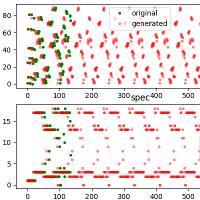      | 180215 | [Linear Music Generation](./projects/linmusicgen)  |
| 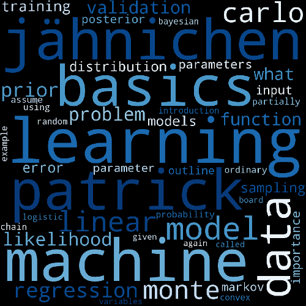          | 180214 | [Lecture Clustering](./projects/ML_EXAM)           |
| 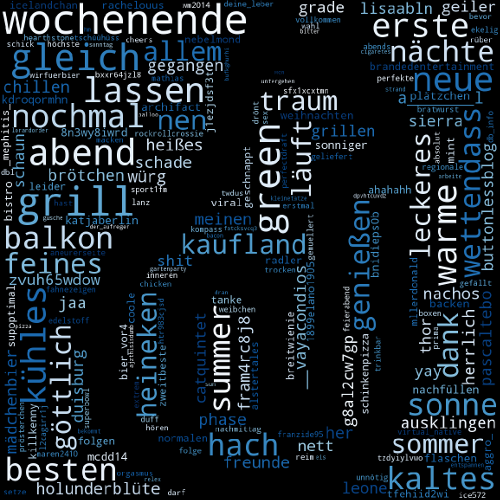           | 180212 | [Positive,Negative?](./projects/PosNeg)            |
| 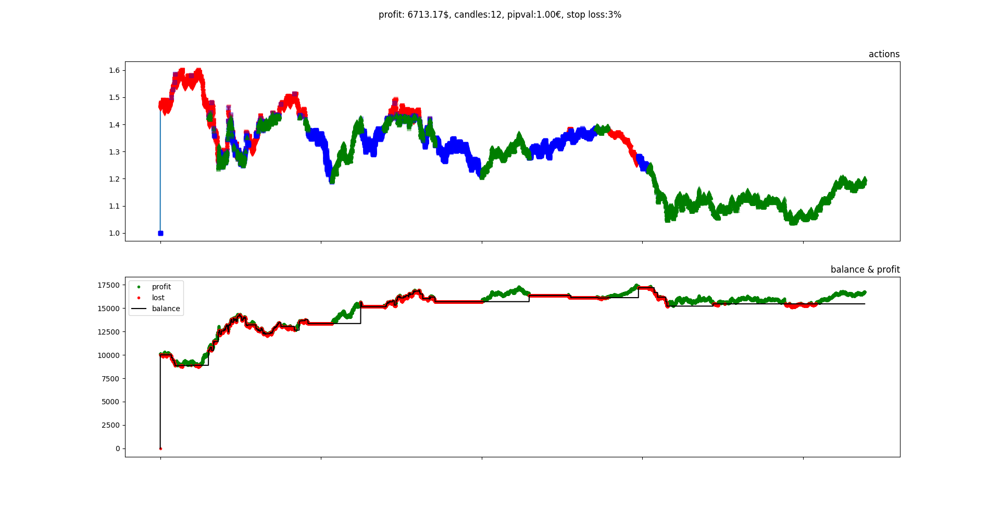 | 180210 | [RLTradingv0.75](./projects/RLTradingKickoff)      |
| 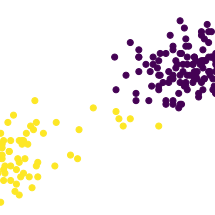          | 180120 | [k-Means](./projects/k_means)                      |
| 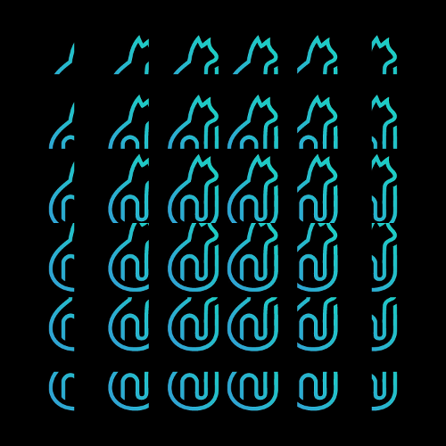           | 180108 | [Im2Col](./projects/im2col)                        |
| 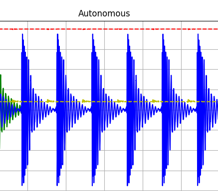         | 171211 | [Music Generation](./projects/musicgen)            |
| 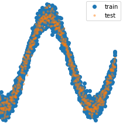           | 171205 | [Ridge Kernels](./projects/kernel)                 |
| 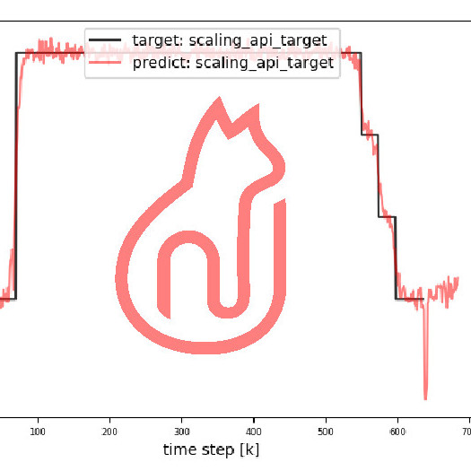         | 171128 | [Predictive Maintainance](./projects/predmain)     |
| 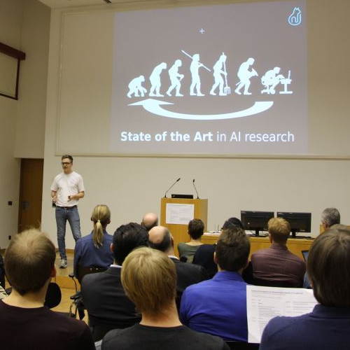              | 171114 | [Humboldt Innovation](./projects/hui)              |
| 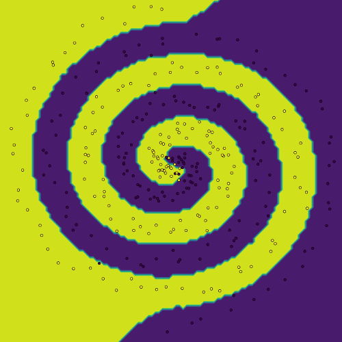              | 171106 | [k-Nearest Neighbor](./projects/kNN)               |
| 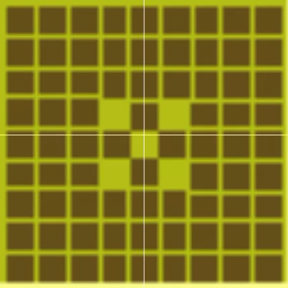            | 170918 | [SnaKI](./projects/SnaKI)                          |
