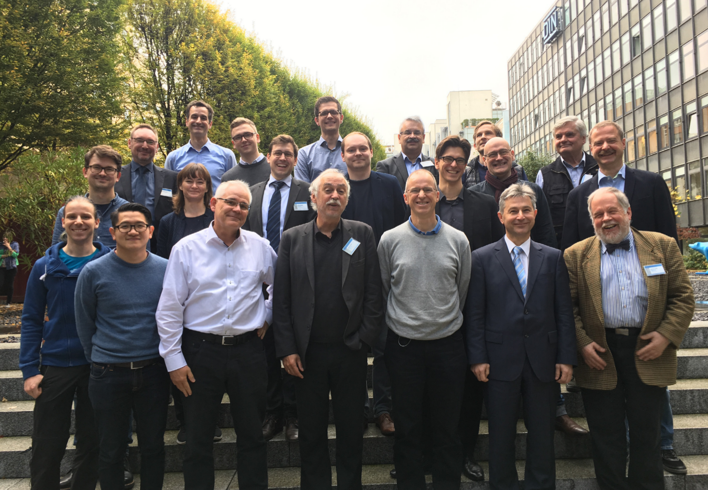

# DIN Workshop

We are proud to initiate the first standardisation committee worldwide attacking the risks of Artificial Intelligence. On the 23th october 2017 we hold a Impulse presentation to warm up the topic. Afterwords we exchanged our ideas with a group of experts in Artificial Intelligence.

## Presentation

<object data="./mpulsvortrag.pdf" type="application/pdf">
    <embed src="./mpulsvortrag.pdf">
        This browser does not support PDFs. Please download the PDF to view it: <a href="http://florens.io/projects/DINws/mpulsvortrag.pdf">Download PDF</a>.

    </embed>
</object>
