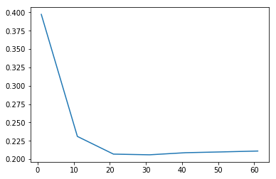

## Task
ML Jähnichen HUB

>Download the Census Income data set 1. Your task is to classify data points into predicted
income lower than or larger than $50K/yr.

>**(a)** Use a suitable library to load the data. Compile a training set (from the [adult.data](https://archive.ics.uci.edu/ml/machine-learning-databases/adult/adult.data) file) and a test set ([adult.test](https://archive.ics.uci.edu/ml/machine-learning-databases/adult/adult.test)). A description of the available features (input dimensions) is given in [adult.names](https://archive.ics.uci.edu/ml/machine-learning-databases/adult/adult.names).**[...]**


```python
# For this task, I need to 
import pandas as pd # for dataset orchestration, and
import numpy as np # for flexible computation.

```

First of all we take a closer look at the data set "Census income data" and adapt it as described in the task. We wrote the follwing methods for this:

**Note** *for rerunning the code: For compatibility. Please attach the files [adult.test](https://archive.ics.uci.edu/ml/machine-learning-databases/adult/adult.test) and [adult.data](https://archive.ics.uci.edu/ml/machine-learning-databases/adult/adult.data) in the directory of this notebook. Make sure, that the first line of [adult.test](https://archive.ics.uci.edu/ml/machine-learning-databases/adult/adult.test) is deleted.*


```python
def census_income_data():
    """
    Import training- and test data from two text files representing "Census
    Income Data".

    :return:  list(pandas.DataFrame), two tables, train and test respectively
    """
    # name columns
    column_names = [

        # attributes
        "age", "workclass", "fnlwg", "education", "education-num",
        "marital-status", "occupation", "relationship", "race", "sex",
        "capital-gain", "capital-loss", "hours-per-week", "native-country",

        # label
        "label"
    ]

    # read from files
    data = map(lambda filename:

               # extract table representation from files
               pd.read_table(filename,
                             sep=',',
                             header=None,
                             names=column_names),

               # with these file names
               ["adult.data", "adult.test"]
               )

    return data

# get the results
train, test = census_income_data()
```

> **[...]** For further processing, keep all continous input dimensions. Additionally, add the feature  
- “workclass” (use 
    - “Private”, 
    - “self-employed” = { “Self-emp-not-inc”, “Self-emp-inc”},
    - "government-employed” = {“Federal-gov”, “Local-gov”, “State-gov”} and 
    - “unemployed” = {“Without-pay”, “Never-worked”}), 
- education (
    - “higher education” = {“Doctorate”, “Masters”, “Bachelors”}, 
    - “high school” = {“HS-grad”, “Some-college”, “Prof-school”, “Assoc-acdm”, “Assoc-voc”}) and 
    - “lower education” (all therest)) 
    and 
- sex

>Plus introduce the appropriate number of dummy variables. This should result in a total of **12** input dimensions (not including the intercept one-padding). You may drop data points with missing data.


```python
def exc_a(df):
    """
    Task 2.a wants us to
    - group attributes,
    - delete some columns, 
    - delete some incomplete rows (incomplete data) and
    - introduce dummy variables

    :param df: (list) pandas.DataFrame (containing "Census Income Data")
    :return: a clean pandas.DataFrame 
    """
    # the input has to be a Pandas,DataFrame
    assert type(df) is pd.core.frame.DataFrame, \
        "Only accept pandas.DataFrame as input"

    # group attributes---------------------------------------------------------
    df = df.replace(
        {  # group attributes as described in the task
            # workclass
            'workclass':
                {
                    # self-employed
                    "Self-emp-inc|Self-emp-not-inc":
                        "self-employed",
                    # government-employed
                    "Federal-gov|Local-gov|State-gov":
                        "government-employed",
                    # unemployed
                    "Without-pay|Never-worked":
                        "unemployed"
                },
            # education
            'education':
                {
                    # higher education
                    "Doctorate|Masters|Bachelors":
                        "higher education",
                    # high school
                    "HS-grad|Some-college|Prof-school|Assoc-acdm|Assoc-voc":
                        "high school",
                    # lower education
                    "11th|9th|7th-8th|12th|1st-4th|10th|5th-6th|Preschool":
                        "lower education"
                }

        },
        # respect Strings:
        regex=True
    )

    # delete incomplete rows---------------------------------------------------
    for col in df.columns.values:
        # catch non-string errors in each column
        try:
            # delete incomplete row
            df = df[df[col].str.strip() != '?']
        except AttributeError:
            continue

    # introduce dummy variables------------------------------------------------
    dummies = pd.get_dummies(df.workclass), \
              pd.get_dummies(df.education), \
              pd.get_dummies(df.sex), \
              pd.get_dummies(df.label)

    # n attributs only need (n-1)-dummy variables, thus we can erase one column of each dummy
    dummizer = lambda x: x.drop(x.columns[0], axis=1)
    work_dummy, edu_dummy, sex_dummy, label_dummy = map(dummizer, dummies)

    # delete unnecessary columns-----------------------------------------------
    drop_col = [

        # these are not needed for the exercise
        'marital-status', 'occupation', 'relationship', 'race',
        'native-country',

        # these exist as dummies already
        'workclass', 'education', 'sex', 'label'
    ]
    df = df.drop(drop_col, axis=1)

    # append dummies to the DataFrame
    df = pd.concat([df, work_dummy, edu_dummy, sex_dummy, label_dummy], axis=1)

    return df

# execute exc_a for training and test set
train, test = map(exc_a, [train, test])
```

To verify that we did everything correctly, we will present the names and indices of the resulting data frames. Additionally, we will take a look at the shape: we see that we have exactly 12 input dimensions and a 13th column, which represents the labels. Besides we realize that we have less rows than before. This is due to the removal of imcomplete data.


```python
print("Analize a)\n")
header = train.columns.values
print("#" * 43)
print("indices \t header")
print("-" * 43)
for i, j in enumerate(header):
    print(i, '\t' ,j)
print("#" * 43)
print("train, test :shape:", train.shape, test.shape)
```

    Analize a)
    
    ###########################################
    indices 	 header
    -------------------------------------------
    0 	 age
    1 	 fnlwg
    2 	 education-num
    3 	 capital-gain
    4 	 capital-loss
    5 	 hours-per-week
    6 	  government-employed
    7 	  self-employed
    8 	  unemployed
    9 	  higher education
    10 	  lower education
    11 	  Male
    12 	  >50K
    ###########################################
    train, test :shape: (30162, 13) (15060, 13)


> **(b)** Use your implementation of k-nearest neighbors from last week and apply it to this
data set. What do you observe?

Let's recap last week. We have a class taking two numpy arrays X (shape=(M,N)) and y (shape=(M,)) with dtype np.float64 and np.int64 respectively. 

To secure the right inputs we work with python assertations. 

The class gives you a prediction of the labels for a given dataset. As an additional input you have to provide a k value. Additionally the class can crossvalidate different k visually - in order to help you choosing the optimal k.


```python
import matplotlib.pyplot as plt

class kNN:
    def __init__(self, X, y):
        """
        Suspecting X and y in the form
        :param X: numpy array shape=(M,N), dtype=np.float64
        :param y: numpy array shape=(M,), dtype=np.int64
        """
        assert type(X) is np.ndarray and X.dtype is np.dtype('float64'), \
            "X must be numpy.ndarray of dtype np.float64, but is %s" % \
            str(X.dtype)
        assert type(y) is np.ndarray and y.dtype is np.dtype('int64'), \
            "X must be numpy.ndarray of dtype np.int64, but is %s" % \
            str(y.dtype)

        self.X = X
        self.y = y
        self.N = self.X.shape[1]

    def predict(self, k, points):
        """
        Predicting as k-Nearest neighbor classifier for the given (data) points
        :param k: integer
        :param points: numpy array of shape=(M,N)
        :return: numpy array of shape=(M,) representing classes
        """
        # self-discipline
        assert points.shape[1] == self.N, \
            "data points have the wrong dimension %i, but should be %i" % (
                points.shape[1], self.N)

        # choose perfect amount of predictions
        predictions = points.shape[0]

        # preallocate class predictions
        _y = np.empty(shape=predictions)
        for i, p in enumerate(points[:predictions]):
            # measure distance from points to the given dataset X
            _d = np.linalg.norm(self.X - p, axis=1)

            # get k smallest indices
            near = _d.argsort()[:k]

            # count occurrence of class values
            counts = np.bincount(self.y[near])
            # add to the class predictions the most frequent
            _y[i] = np.argmax(counts)
        # return the predictions
        return _y

    def loss(self, y, _y):
        """

        :param y: real label
        :param _y: calculated label
        :return:
        """
        return np.mean(np.abs(y - _y))

    @staticmethod
    def k_compare(
            knn, X, y,
            start=1, stop=100, step=1
    ):
        """
        Compare kNN for different k
        :param knn: kNN object
        :param X: test data
        :param y: test labels
        :param start: minimal k
        :param stop: maximal k
        :param step: step between k
        """
        ks = []
        losss = []
        min_loss = float('inf')
        best_k = 0
        for k in range(start, stop, step):
            _loss = np.mean(
                np.abs(knn.predict(k, X) - y))
            if _loss < min_loss:
                min_loss = _loss
                best_k = k

            ks.append(k)
            losss.append(_loss)

        plt.figure()
        plt.plot(ks, losss)
        plt.show()

        return best_k, min_loss
```

With that mindset we just need to convert the pandas table to the suitable format. And we can use all the beauty from our kNN class. 

Before we start, we will preprocess the data to get a fair comparison between the kNN and the upcoming MLE algorithm.


```python
def prepro(X):
    """
    Assuming float numpy array with the following coordinates
    :param X: Numpy of shape=(data, dim), where 'data' represents the amount of
    datapoints and 'dim' represents the dimensionality of the data
    :return: zero centered and normed representation of X
    """
    norm_center = (X - X.mean()) / (X.max() - X.min())
    
    return norm_center

def exc_b(train, test, k=1):
    """
    Task 3.b requires to
    - convert pandas to numpy,
    - implement the data into our kNN classifier and
    - for the fun sake, visualize different k's.

    :param train: pandas.DataFrame with required "consensus income data" training set
    :param test: pandas.DataFrame with required "consensus income data" test set
    :return: best_k, min_loss, X_train, y_train, X_test, y_test
    """
    # convert data to required format------------------------------------------
    
    # convert to numpy
    _train, _test = map(lambda x: x.as_matrix(), [train, test])
    
    # divide label from attribute
    Xytrain, Xytest = map(lambda x: [x[:, :-1], x[:, -1]], [_train, _test])
    
    # convert to correct numpy.dtypes
    X_train, X_test = map(
        lambda x: x.astype(np.float64), [Xytrain[0], Xytest[0]])
    y_train, y_test = map(
        lambda y: y.astype(np.int64), [Xytrain[1], Xytest[1]])
    
    # normalize and zerocenter the data
    X_test, X_train = map(prepro, [X_test, X_train])
    
    # use existing kNN implementation-----------------------------------------
    
    # feed class with training data
    knn = kNN(X=X_train, y=y_train)
    
    # predict the testset
    _y = knn.predict(k=k, points=X_test)

    best_k, min_loss = kNN.k_compare(knn, X_test, y_test,
                                     start=1, stop=70, step=10)

    return best_k, min_loss, \
           X_train, y_train, X_test, y_test
    
# execute exc_b for training and test data 
print("Analize b):")
best_k, min_loss, X_train, y_train, X_test, y_test = exc_b(train, test)
print("Minimal loss:", min_loss , "with k =", best_k)
```

    Analize b):





    Minimal loss: 0.205909694555 with k = 31


What do we observe? First of all, due to the size of the datasets the calculations take quite some time. This is the prize we have to pay for "lazy learning". All the calculations have to be done during prediction. Apart from this, the results are quite impressive. We achieve around 79% accuracy on a real world data set with this rather simple algorithm. 

>**(c)** Implement a logistic regression algorithm and fit its parameters using maximum likelihood. Try out different intializations for θ and report the average accuracy 
acc= #correct / #data

>Use the gradient ascent algorithm developed in the lecture

Here, we implement the MLE class. This class consists of several methods: the most important method is the learning algorithm (logistic regression with maximum likelihood objective function). In order to improve the gradient ascent, we implemented the Armijo rule for the determination of step sizes. You also find a method that simply helps you to calculate the accuracy of the learned model:


```python
class MLE:
    def __init__(self, X, Y):
        """
        Suspecting X and y in the form
        :param X: design matrix as numpy array with shape=(n,feat),
        dtype=np.float64
        :param Y: labels as column vector, again numpy array with shape=(n,),
        dtype=np.int64
        """
        self.X = X
        self.Y = Y
        self.n = self.X.shape[0]
        self.feat = self.X.shape[1]
        self.theta = 0.1 * np.random.randn(self.feat) # initialization with rescaled standard normal distribution

         
    def eval_like(self, theta, X, Y):
        """
        Calculates the log-likelihood function
        :param X: design matrix as numpy array with shape=(batch,feat), dtype=np.float64
        :param Y: labels as column vector, again numpy array with shape=(batch,),
        dtype=np.int64
        :param theta: theta values that should be considered for evaluation, shape=(feat,)
        :return: evaluated function
        """
        b = X.shape[0]
        l = np.inner(Y,np.matmul(X,theta)) - np.inner(np.log(np.exp(np.matmul(X,theta))+1),np.ones(b))
        
        return l
    
    def Armijo(self, gradient, X, Y):
        """
        Determines step sizes to secure a sufficient increase of the log-likelihood function
        """ 
        beta = 0.9999
        gamma = 0.2
        sigma = 1.0
        
        # determine step size
        step = self.theta + sigma * gradient
        while self.eval_like(step, X, Y) <= self.eval_like(self.theta, X, Y) + sigma * gamma * np.inner(gradient, gradient):
            sigma = sigma * beta
            step = self.theta + sigma * gradient
        
        return sigma
        
    def learn(self, batch=40, episodes=100000):
        """
        Simple gradient ascent method with Maximum Likelihood
        :return: None
        """
        for i in range(episodes):
            idx = np.random.randint(self.n, size=batch)
            X = self.X[idx, :]
            Y = self.Y[idx]

            odds = np.exp(np.matmul(X, self.theta))
            h = odds / (1 + odds)
            gradient = np.matmul(np.transpose(X), Y - h)
            self.theta = self.theta + self.Armijo(gradient, X, Y) * gradient
    
    
    def av_acc(self, test_X, test_Y):
        """
        Only goal here is to calculate average accuracy on input
        :param test_X: numpy test data set
        :param test_Y: numpy corresponding labels
        :return: average accuracy
        """
        size = test_X.shape[0]
        odds = np.exp(np.matmul(test_X, self.theta))
        h = odds / (1 + odds)

        h[h > 0.5] = 1
        h[h <= 0.5] = 0
        res = h - test_Y
        av_acc = len(res[res == 0]) / size

        return av_acc

# let's check the performance  
print("c): Accuracy with different initializations:")
for i in range(5):
    mle = MLE(X_train, y_train)
    mle.learn(batch=40, episodes=100000)
    print(i+1 , ":", mle.av_acc(X_test, y_test))
```

    c): Accuracy with different initializations:
    1 : 0.7944223107569721
    2 : 0.7942231075697211
    3 : 0.7941567065073041
    4 : 0.7944223107569721
    5 : 0.7956839309428951


Ok, this method is a lot faster! It takes only seconds to learn suitable thetas. The performance varies with the initialization of the thetas and the chosen hyperparameters. With the above hyperparameters it achieves (on average) 79.43% accuracy. Thus we have to admit that the performance of kNN can be better in a few cases / runs. But still: we have comparable performance levels between the two algorithms, and logistic regression is fast!

Best,

Florens & Felix
