# Machine Learning Basics, by Patrick Jähnichen
Humboldt Universität zu Berlin.

Um in fahrt zu kommen, dacht ich mein neurocat knowledge direkt anzuwenden. Wordcluster for conditional quantities.

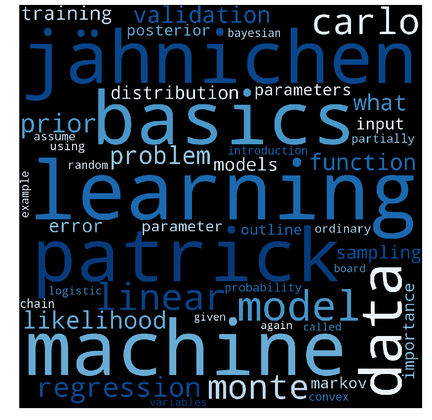

## Lecture 01 - Introduction

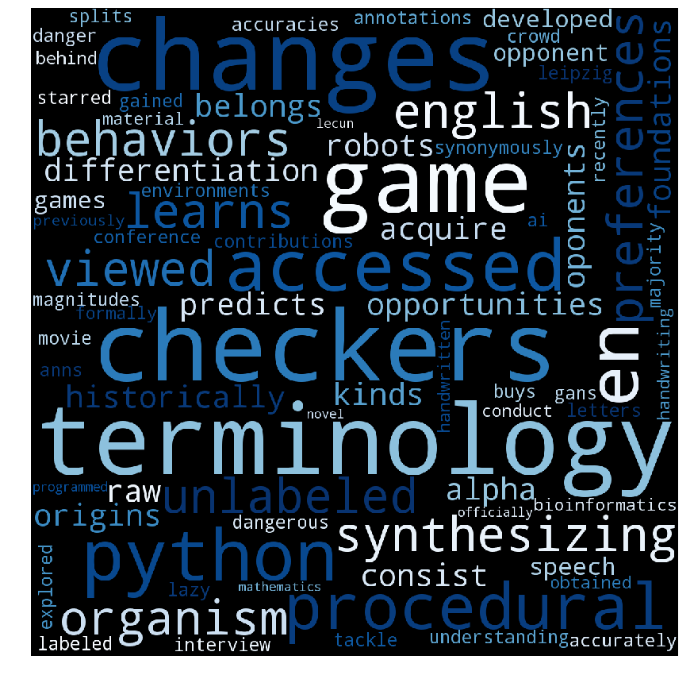

- **Training**: use all inputs to train the computer and find hidden structure in the data
- **Prediction**: use trained computer to assign new inputs to groups of previously seen data or compute a feature
- **Clustering**: discover groups of data based on the input
 - **kNN**
- **Association rule learning**: discover rules that describe your data
- **Examples**
    - **Recomondation**: Amazon
    - **Cluster**: Identify Earthquake danger zones
- The computer program that finds f (or g) is synonymously also called **learning machine** or **learning algorithm**
    - we want $$ E[p(f(x) \neq y)] $$ as small as possible
   
### Course Program

1. Mathematical and statistical foundations
2. Linear prediction/regression models
3. Maximum Likelihood
4. Overfitting, regularization and cross-validation
5. Optimization
6. Binary classification, max-margin classifiers, SVMs
7. Dimensionality reduction techniques
8. Bayesian machine learning
9. Clustering and Bayesian mixture models
10. Models of mixed membership
11. Inference Methods I (monte carlo sampling)
12. Inference Methods II (variational inference)
13. Gaussian process regression *not covered*

### Literature

[Hastie, Tibshirani, Friedman: The Elements of Statistical Learning (chapter 1)](./literature/The_Elements_of_Statistical_Learning)

## Lecture 02 - Math revision & statistical learning theory

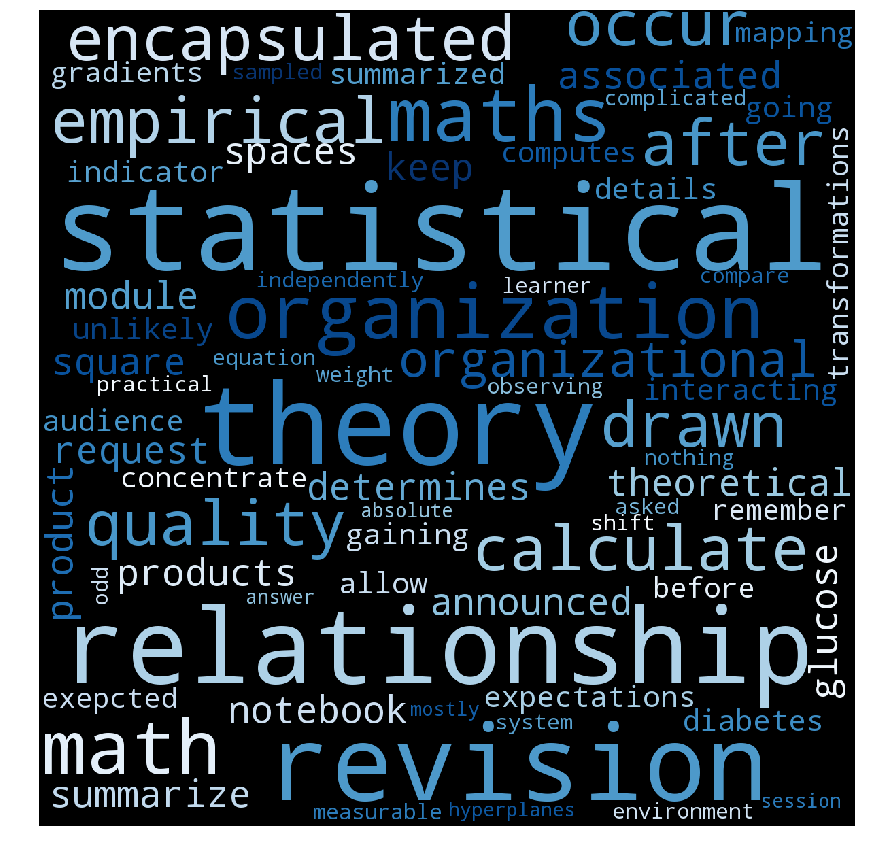

### Math revision
- vector, a matrix
- some matrix properties
- vector and matrix products
- norms
- transformations and hyperplanes
- gradients

### Probability Revision
- random variable
- measurable and probability spaces
- probability density and mass functions
- sum and product rule of probability
- Bayes’ theorem
- expectations

### statistical Learning
- assume there is a relationship $$Y=f(X)$$
- **learning**: acquiring new knowledge by interacting with the environment, gaining experience
- **Machine Learning**: make computers learn from data
- distinguish between **supervised** $$(X \times Y$$ and **unsupervised** $$X$$ learning
- **Learning Algorithm** (supervised): $$ ({X \times Y})^M \mapsto \hat{f}_n $$
    - $$\hat{f}_n$$ is a summary of the training data $$({X \times Y})^n$$ (approximation of $$f$$)
    - Loss:
        - measure of performance: $$ L:({Y \times \hat{Y}})^N \rightarrow \mathbb{R} $$
            - Indicator
            - L1
            - L2
        - quality: $$ \mathbb{E}[L(y, \hat{f}_n)] $$ (careful P ist unknown $$\rightarrow$$ empirical loss)
        - distinguish between expected loss $$L(f)$$ and empirical loss $$\hat{L}(f)$$
    - minimize empircal loss
- **predict**: compute labels $$(\hat{Y})^M$$ for unseen data $$(\hat{X})^M$$
- **inference**: unsicher ob Jähnichen das verstanden hat
- **P**:
    - Wir kennen NICHT die Verteilung **P** der Daten, we only **observe** data $$ \lbrace (x_1 , y_1 ),(x_2 ,y_2 ),\dots \rbrace $$ samples from **P**
    - we make assumptions on the population of all (x, y). 
    - **We only observe a sample!!!**
    
### What is random?
- $$\hat{L}(f)$$ is random 
    - *keine ahnung was der Künstler uns hiermit sagen will, aber vermute, dass er meint, dass wir niemals L erhalten, sondern Empirischen Erwartungswert bestimmen auf Beobachtung der Zufallsvariable $$L^*$$
- $$\hat{f}_n$$ is a random quantity
    - a random function, output of our learning procedure
- $$L(\hat{f}_n)$$ is random
- for given $$f$$ $$L(f)$$ is not random

## Lecture 03 - Linear Models

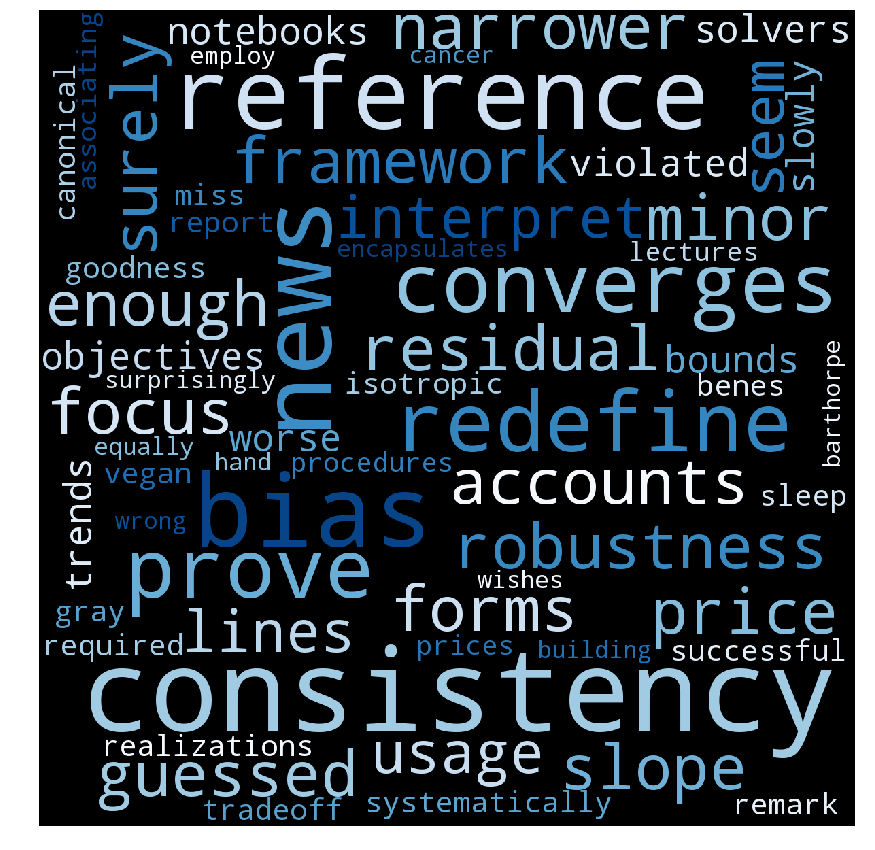

### Gold Standard
- smallest expected loss is achived by the **Bayes optimal function**: $$f^* = \text{arg}\min_{f} L(f)$$
- the lowest value for the expected loss is called the **Bayes error**: $$L(f^*) = \inf_{f} L(f)$$
    - this can be larger then zero, may count as measure of complexity of the problem
- **We cannot calculate any of the above quantities, since $$P$$ is unknown**

### Consistency
- can we garuantee that $$L(\hat{f}_n)-L(f^*)$$ is small for large enough sample size $$n$$?
- an algorithm that ensures $$\underset{n \to \infty}{\lim}L(\hat{f}_n) = L(f^*)$$ almost surely, is called **consistent**
    - easy for finite or countable sets
    - not too hard if $$X$$ is infinite and the underlying relationship between $$X$$ and $$Y$$ is continous
    
### No free lunch!
- Every System only works on the prior it strives to satisfy.
- This means on average (for every P) no solution will perform better then a random guess, because for any algorithm $$\hat{f}_n$$, any n and $$\epsilon>0$$ there exists a distribution $$P$$ such that $$L(f^*)=0$$ and $$\mathbb{E}L(\hat{f}_n) \geq \frac{1}{2}-\epsilon$$
- furthermore for any algorithm $$\hat{f}_n$$ and any sequence $$a_n$$ that converges to $$0$$, there exists a ditribution $$P$$ such that $$L(f^*)=0$$ and for all $$n$$, $$\mathbb{E}L\hat{f}_n \geq a_n$$. So our Algorithm will converge as slow as possible.
- *ist aber auch ne behinderte Annahme. Man kann doch sehr wohl einen Algorithmus formulieren, der alle P in einem gewissem subspace realer Probleme optimiert und überall außerhalb beliebig schlecht performt.*

### Discriminative, Generative

We have always a bit of prior domainknowledge. There are two ways of encorporating prior knowledge (diskriminative, generative)

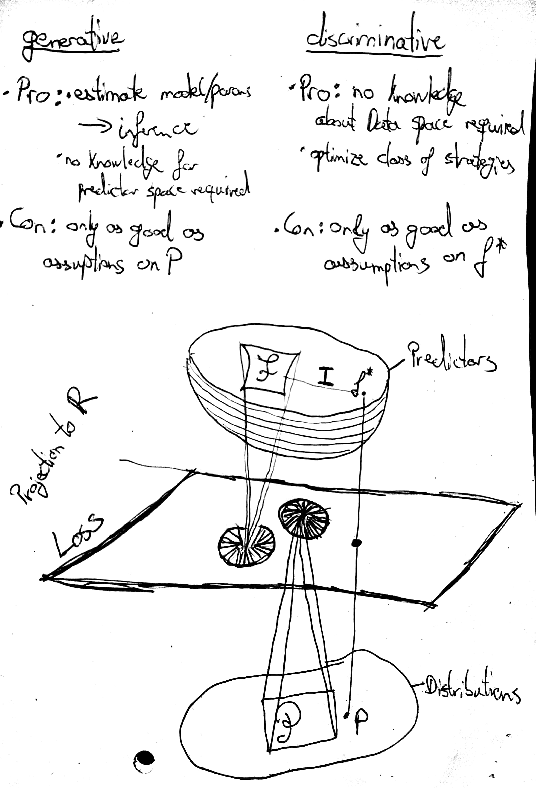

#### generative
- directely
- assume $$P$$ is not arbitrary (model approach, statistical modeling, generative approach)
- **Pro**: can estimate model/parameters of $$P$$ (inference)
- **Con**: not sure what the analysis says if the assumption is violated

#### discriminative
- indirectely
- redefine the goal. Perform as well as a reference set $$\mathcal{F}$$ of predictors. $$L(\hat{f}_n) - \min_{f \in \mathcal{F}}L(f)$$
- $$\mathcal{F}$$ encaplsulates the **inductive basis**
- **Pro**: no direct assumptions on $$P$$, rather put prior knowledge into what predictors could perform well 
- **Con**: cannot realy interpret $$\hat{f}_n$$

**Sample Complexity?**

### Linear Regression
*all models are wrong, but some are useful.*

- discriminative approach: assume $$f*$$ is linear
- strict assumption

### Homework
- Reading elements of statistical learning chapter 3.1, 3.2.
    - 3.1 Linear Methods for Regression:
        - 

## Lecture 4 - Beyond linearity, logistic regression and maximum likelihood

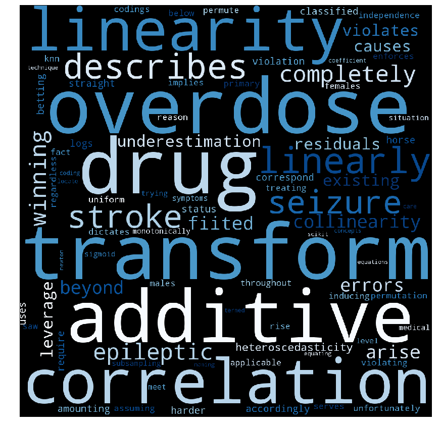

## Lecture 05 - Overfitting, Regularization and Cross-Validation

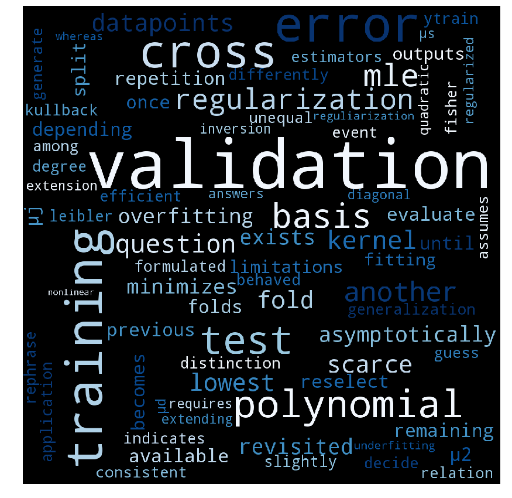

## Lecture 06 - Optimization

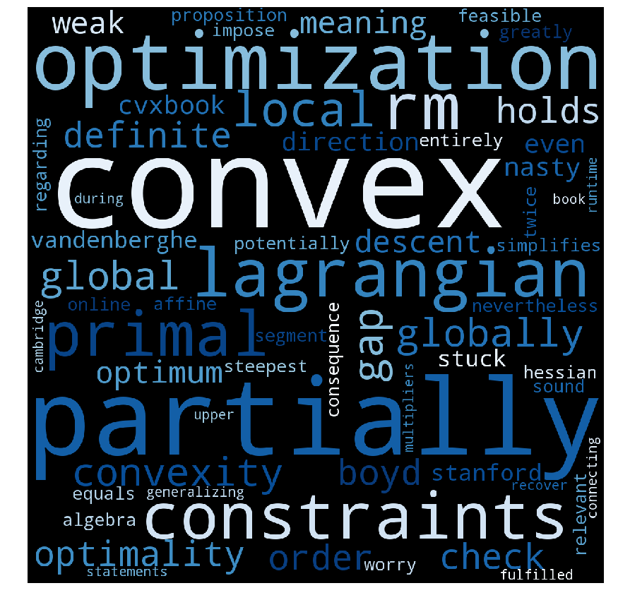

## Lecture 07 - Support Vector Machines

## Lecture 08 - Dimensionality Reduction

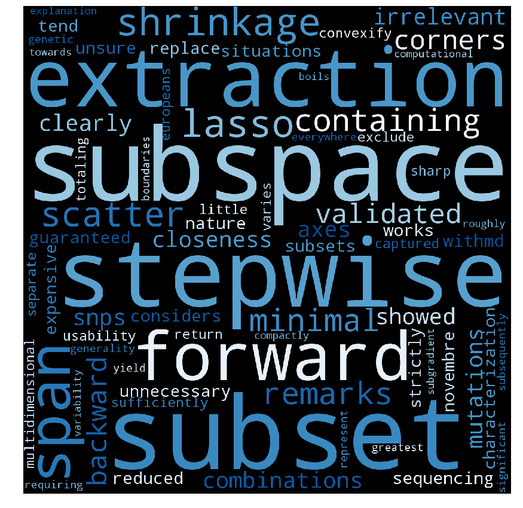

## Lecture 09 - Bayesian Machine Learning

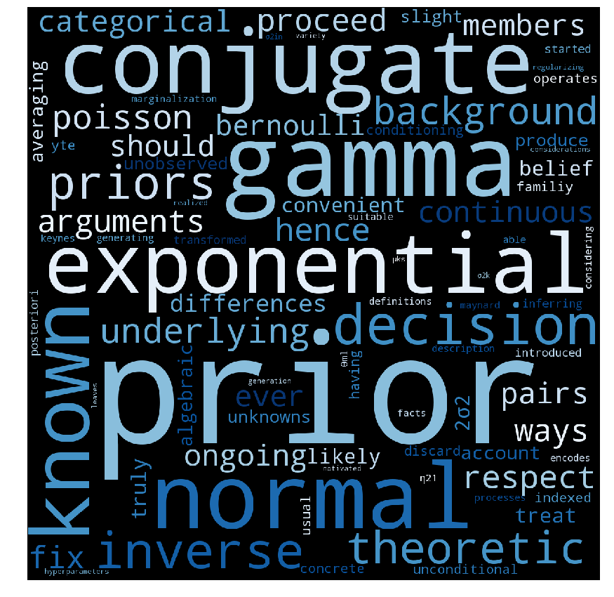

## Lecture 10 - Probabilistic Graphical Models & Mixture Models

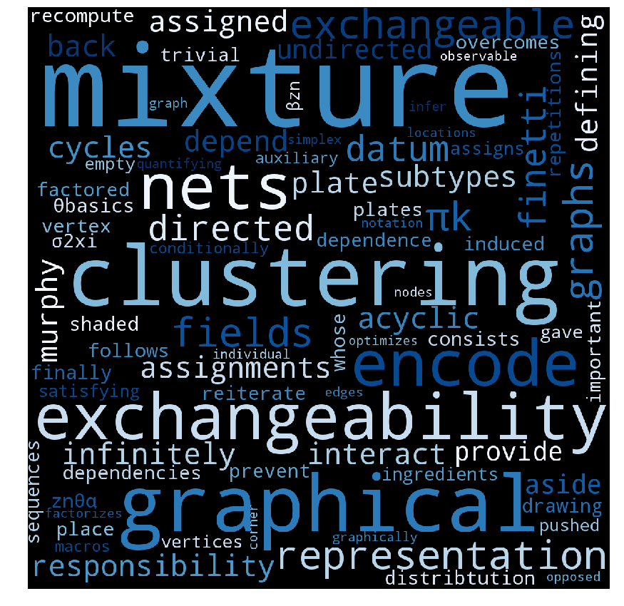

## Lecture 11 - Expectation Maximization & Models of Mixed Membership

## Lecture 12 - Monte Carlo Methods for Bayesian Inference
guest lecture: Imgmar Schuster

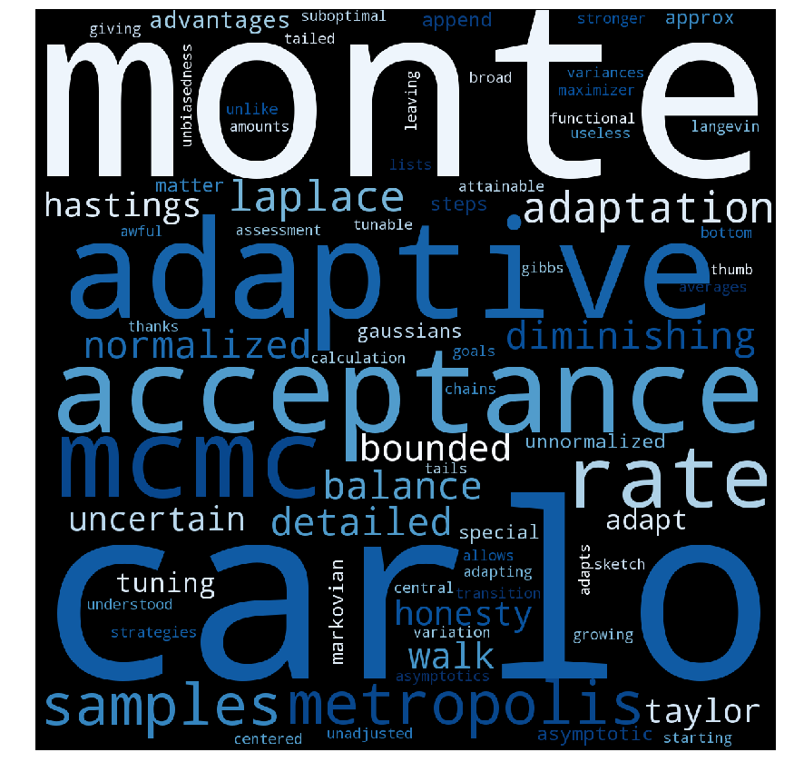

## Lecture 13 - Variational Inference

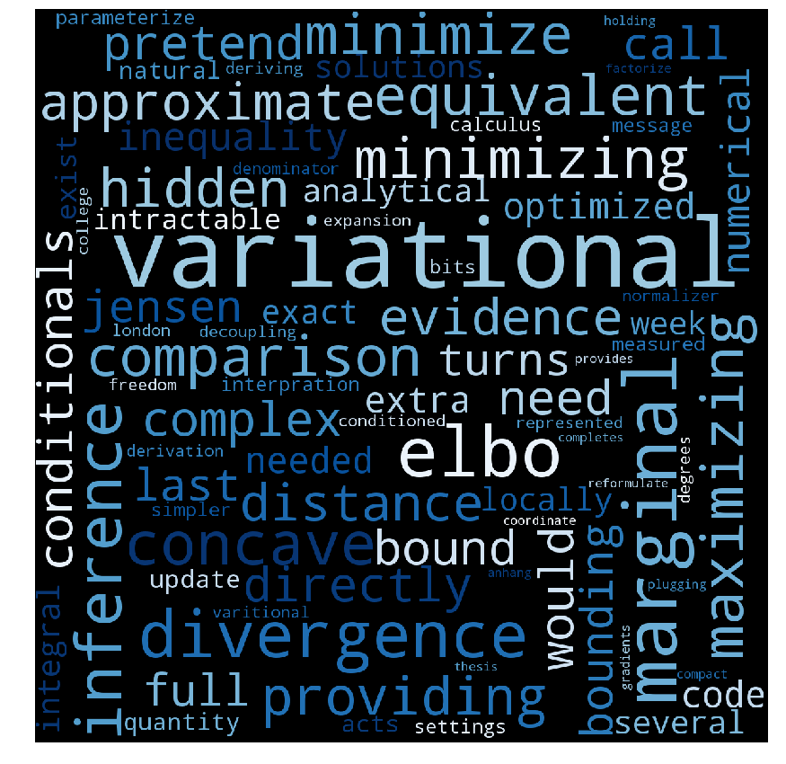

