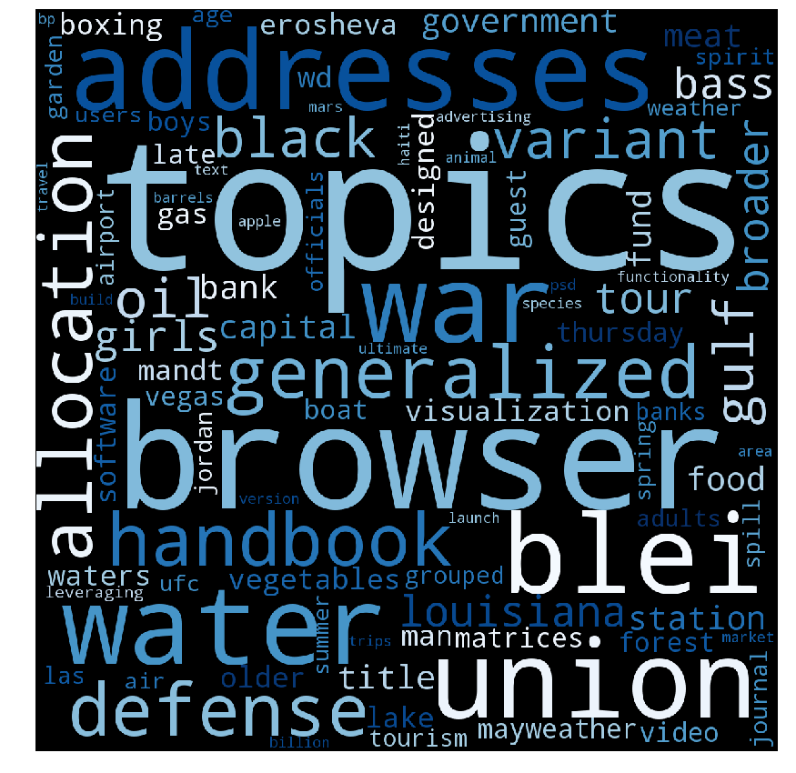

```python
from tika import parser
from wordcloud import WordCloud
from matplotlib import pyplot as plt
import re
import numpy as np

from sklearn.feature_extraction.text import CountVectorizer
from sklearn.feature_extraction.text import TfidfTransformer
```


```python
bad_words = [
    'org', 'www', 'jan','oct','9th','user','priori', 'am','wikipedia','90','roaming','5th','samuel','py','yn','co',
    'y6','y1','px','dsup','ll','92401635','7th','minβ','10th','ve','errs','eu','id','hat','login','publish','she',
    'blood','yes','stuff','me','cons','h0','mv','754','cont','erm','liu','con','ha','greninger','van','lightfoot',
    'tamborero', 'is', 'the', 'of','wisonsin','mironenko','soon','soleimani','lopez','garnett','aben','richardson',
    'wessels','rodriguez','moran','740','knijnenburg','rse','gonçalves','mitropoulos','deng','haber','marius','kloft', 
    'rn','bx','qp','rd','gj','fi','ax','f0','xt','slides','qps','2004','hf','mh','yo','qt','limn','oi','c0','supx',
    'wk','maxw','md','xx','itmk','576','w1','wj','mn','sn','m0','eq','const','zj','kl','zi','dz','min','2003','airoldi',
    'ab','xnyn','kn','gmms','pk','de','rik','zn','yi','or','not','as','at','one', 'x1','be','but','kloft','non','do',
    'for','eq','be','18','from','xi','by','and','if', 'xi','kl','19','it','will', 'are', 'on', 'we','when', 'log',
    'that', 'each', 'let', '57', 'exp', 'now', 'how','νi','νx','νti','νj','ti', 'argmin','ν1', 'limi','kn','κn',
    '00','OO','mc','si','cant','cdf', 'thin','si','been','vice','limit','sup','law',
    'ars','arsnova','part','room','pair','ross','pro','vis','iorio', 'july','pros','half','copy','91','logit','ctrl',
    'hθ','xiks','θ3x1x2','yis','yiθ','nk','x2i','big','μs','1x','δ2id','δ2','θpx','θ3','1φ','1λ','μj','μ2','θ2x2i','μd','δ2θ',
    'hf0','f1', 'deal', '1ps','mx','αifi','θf','θx2', 'βjgj','gm','g1','ops', 'λt','cx','ops','fn','xglobal','g1','i1f',
    'αi', 'xj', 'n2','ξi', 'anyn', 'αnyn','h1','rna','ξn','minx','iξi','αiyi','hi','n2','α1','αi', 'to', 'have','this',
    'some', 'xij','tth','τth','contd','xp','xtrainθ', 'xvalθ', 'val','μ2','μj','μd','xtrain','rr','ill','xtrain','helps',
    'width','slater', 'xfeas','edu', 'lemma', '1ps', 'lps','1p','lp','web','semi','h1','r2','sites', 'αn','αiyixi','sign',
    'maxα','tss','αjyjx','α1y1','αiyix', 'four','ξ1','come', 'modelsm0','x3','come','loose','minw','aim','blue','were',
    'my', 'john', 'dθ','mind','kind', 'θom', 'eθ','beta', 'whole', 'in', 'can', 'all',
    'μ2','μs','posed','μd','iterate','set','μs', 'heard','uw','circle','shaped','tries','modelm0','adding','augmentmk',
    'intersect','remove', 'force', 'θmap', 'ok','fully','fθ', 'front','formerly', 'digits', 'lecturer','names','sheet',
    'front','optical','vote','friday', 'gold', 'an', 'all', 'μd', 'μj','who', 'there', 'with', 'dunsup', 'mitigate',
    'itself', 'feeling', 'μs', 'μj', 'μ2', 'μd', 'Μs', 'Μj','Μ2','Μd','μks','θpm','θm1','dy','2πσ2','xte', '2η2', '4η2', 
    'say', 'βκ', 'βk', 'dirk', 'real', 'l2', '12', 'xσ', 'σ0', 'β1','β0', 'mult', 'claim', 'gmm', 'dags','σ2x', 'star', 
    'gp', 'σzi', 'τtd', 'foods', 'aistats', 'was', 'versa', 'vice', 'len', 'ty', 'goes', 'sizes', 'avoid', 'langevon', 
    'proxy', 'others', 'beal', 'tt', 'en'
]    
    
def get_content(x):   
    cont=[]
    for _x in x:
        parsedPDF = parser.from_file(_x)
        _cont = parsedPDF['content']
        _cont = re.split('\W+', _cont)
        cont += _cont
    
    return cont

def summary(d, maxi=100):  
    d = {k: v for k, v in d.items() if k not in bad_words}

    im=WordCloud(width=1200, height=1200, colormap='Blues', max_words=maxi).generate_from_frequencies(d)
    plt.figure( figsize=(15,15) )
    plt.imshow(im)
    plt.axis('off')
```


```python
def _embedding(X):
    """transforms bundle of text into frequency of words"""
    # initialize countvectorizer object
    count_vect = CountVectorizer()
    # count words
    X_train_counts = count_vect.fit_transform(X)

    # convert to frequencies, respecting different length of text
    tf_transformer = TfidfTransformer(use_idf=False).fit(X_train_counts)

    return tf_transformer.transform(X_train_counts), count_vect, tf_transformer


def P_cond(S, X, top=100):
    """Take a state from the set(Y) and represent most frequent words."""

    prior = np.mean(S, axis=0)
    obs = np.mean(X, axis=0)

    prob = prior/obs

    priorities = prob.argsort(axis=1)[:,-top:][:,::-1]

    words = np.array(counter.get_feature_names())

    # print(words[priorities])
    top_w = words[priorities.ravel()]
    top_p = prior[:,priorities.ravel()].ravel()

    d = {}
    for i, k in enumerate(top_w[0]):
        d[k] = top_p[0, i]

    return d

def _transformer(x):
    counts = counter.transform(x)
    # convert to frequencies, respecting different length of text
    return text_freq.transform(counts)
```


```python
pdfs = ['lecture%02d.pdf' % (i+1) for i in range(13)]
embedding, counter, text_freq = _embedding(get_content(pdfs))
```


```python
conti=[_transformer(get_content(pdfs[i:i+1])) for i in range(13)]
```

# Machine Learning Basics
Pattrick Jähnichen


```python
p = P_cond(_transformer(get_content(pdfs)),np.ones((1,1)))
summary(p, 500)
```


## Lecture 01 - Introduction


```python
p = P_cond(conti[0], embedding)
summary(p)
```


- **Training**: use all inputs to train the computer and find hidden structure in the data
- **Prediction**: use trained computer to assign new inputs to groups of previously seen data or compute a feature
- **Clustering**: discover groups of data based on the input
 - **kNN**
- **Association rule learning**: discover rules that describe your data
- **Examples**
    - **Recomondation**: Amazon
    - **Cluster**: Identify Earthquake danger zones
- The computer program that finds f (or g) is synonymously also called **learning machine** or **learning algorithm**
    - we want $E[p(f(x) \neq y)]$ as small as possible
   
### Course Program

1. Mathematical and statistical foundations
2. Linear prediction/regression models
3. Maximum Likelihood
4. Overfitting, regularization and cross-validation
5. Optimization
6. Binary classification, max-margin classifiers, SVMs
7. Dimensionality reduction techniques
8. Bayesian machine learning
9. Clustering and Bayesian mixture models
10. Models of mixed membership
11. Inference Methods I (monte carlo sampling)
12. Inference Methods II (variational inference)
13. Gaussian process regression *not covered*

### Literature

[Hastie, Tibshirani, Friedman: The Elements of Statistical Learning (chapter 1)](./literature/The_Elements_of_Statistical_Learning)

## Lecture 02 - Math revision & statistical learning theory


```python
p = P_cond(conti[1], embedding)
summary(p, 500)
```


### Math revision
- vector, a matrix
- some matrix properties
- vector and matrix products
- norms
- transformations and hyperplanes
- gradients

### Probability Revision
- random variable
- measurable and probability spaces
- probability density and mass functions
- sum and product rule of probability
- Bayes’ theorem
- expectations

### statistical Learning
- assume there is a relationship $Y=f(X)$
- **learning**: acquiring new knowledge by interacting with the environment, gaining experience
- **Machine Learning**: make computers learn from data
- distinguish between **supervised** $(X \times Y$ and **unsupervised** $X$ learning
- **Learning Algorithm** (supervised): $({X \times Y})^M \mapsto \hat{f}_n$
    - $\hat{f}_n$ is a summary of the training data $({X \times Y})^n$ (approximation of $f$)
    - Loss:
        - measure of performance: $L:({Y \times \hat{Y}})^N \rightarrow \mathbb{R}$
            - Indicator
            - L1
            - L2
        - quality: $\mathbb{E}[L(y, \hat{f}_n)]$ (careful P ist unknown $\rightarrow$ empirical loss)
        - distinguish between expected loss $L(f)$ and empirical loss $\hat{L}(f)$
    - minimize empircal loss
- **predict**: compute labels $(\hat{Y})^M$ for unseen data $(\hat{X})^M$
- **inference**: unsicher ob Jähnichen das verstanden hat
- **P**:
    - Wir kennen NICHT die Verteilung **P** der Daten, we only **observe** data $\lbrace (x_1 , y_1 ),(x_2 ,y_2 ),\dots \rbrace$ samples from **P**
    - we make assumptions on the population of all (x, y). 
    - **We only observe a sample!!!**
    
### What is random?
- $\hat{L}(f)$ is random 
    - *keine ahnung was der Künstler uns hiermit sagen will, aber vermute, dass er meint, dass wir niemals L erhalten, sondern Empirischen Erwartungswert bestimmen auf Beobachtung der Zufallsvariable $L$ *
- $\hat{f}_n$ is a random quantity
    - a random function, output of our learning procedure
- $L(\hat{f}_n)$ is random
- for given $f$ $L(f)$ is not random

## Lecture 03 - Linear Models


```python
p = P_cond(conti[2], embedding)

summary(p, 500)
```


### Bayesian Framework
- smallest expected loss is achived by the **Bayes optimal function**: $f^* = \text{arg}\min_{f} L(f)$
- the lowest value for the expected loss is called the **Bayes error**: $L(f^*) = \inf_{f} L(f)$
    - this can be larger then zero, may count as measure of complexity of the problem
- **We cannot calculate any of the above quantities, since $P$ is unknown**

### Consistency
- can we garuantee that $L(\hat{f}_n)-L(f^*)$ is small for large enough sample size $n$?
- an algorithm that ensures $\underset{n \to \infty}{\lim}L(\hat{f}_n) = L(f^*)$ almost surely, is called **consistent**
    - easy for finite or countable sets
    - not too hard if $X$ is infinite and the underlying relationship between $X$ and $Y$ is continous
    
### No free lunch!
- We use prior information to match procedures to problems!
- Without prior

## Lecture 4 - Beyond linearity, logistic regression and maximum likelihood


```python
p = P_cond(conti[3], embedding)
summary(p, 500)
```


## Lecture 05 - Overfitting, Regularization and Cross-Validation


```python
p = P_cond(conti[4], embedding)
summary(p, 500)
```


## Lecture 06 - Optimization


```python
p = P_cond(conti[5], embedding)
summary(p, 500)
```


## Lecture 07 - Support Vector Machines


```python
p = P_cond(conti[6], embedding)
summary(p, 500)
```


## Lecture 08 - Dimensionality Reduction


```python
p = P_cond(conti[7], embedding)
summary(p, 500)
```


## Lecture 09 - Bayesian Machine Learning


```python
p = P_cond(conti[8], embedding)
summary(p, 500)
```


## Lecture 10 - Probabilistic Graphical Models & Mixture Models


```python
p = P_cond(conti[9], embedding)
summary(p, 500)
```


## Lecture 11 - Expectation Maximization & Models of Mixed Membership


```python
p = P_cond(conti[10], embedding)
summary(p, 500)
```





## Lecture 12 - Monte Carlo Methods for Bayesian Inference
guest lecture: Imgmar Schuster


```python
p = P_cond(conti[11], embedding)
summary(p, 500)
```


## Lecture 13 - Variational Inference


```python
p = P_cond(conti[12], embedding)
summary(p, 500)
```


