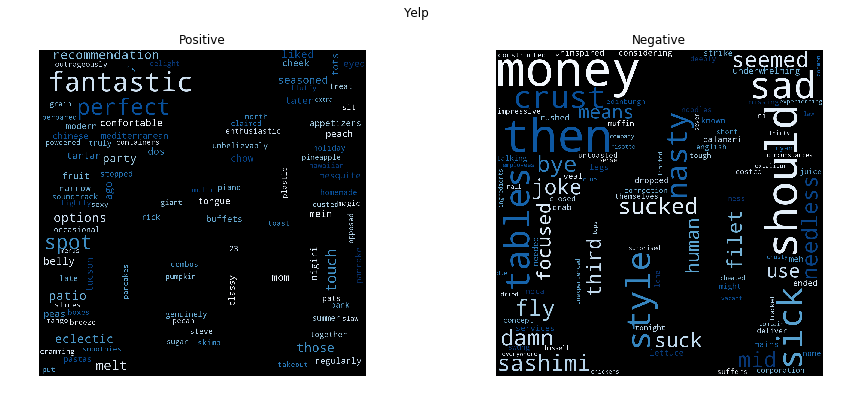

# Positive / Negative ?

In a highdimensional dataworld, finding a hyperplane distinguishing two classes isn't always so complicated. Without domainknowledge nor priors from the language environment a linear regressor gets 80%+ on unseen data. In the appendix you can see the auto generated report for yelp. I took open datasets from Amazon, Yelp, IDMB and twitter for binary segment analysis.

Even simpler statistical models give a beautiful projection of the generative function from positive or negative words in the given prior. Seen in the following:

A very nice example are positive words extracted from a labeled twitter post database on becks (german beer).

You can also see, that on the negative samples, I filtered too much usernames, unfortunally. Prototype can be too weak or I discovered a hidden group of people hating becks.

All of my algorithms are from neurocat. Of course.

## Appendix: Prediction Yelp: 

### Info:
- Author: neurocat algorithm
- File: ./data/yelp_labelled.txt
- Categories: ['Bad', 'Good']
- accuracy: 0.815

|text|nc|truth|
|---|---|---|
|'This was my first and only Vegas buffet and it did not disappoint.'|Good|True|
|'The food was outstanding and the prices were very reasonable.'|Good|True|
|'Gave up trying to eat any of the crust (teeth still sore).'|Bad|True|
|'RUDE & INCONSIDERATE MANAGEMENT.'|Bad|True|
|'This place lacked style!!'|Bad|True|
|'The black eyed peas and sweet potatoes... UNREAL!'|Good|True|
|'If that bug never showed up I would have given a 4 for sure, but on the other side of the wall where this bug was climbing was the kitchen.'|Bad|True|
|'Great food.'|Good|True|
|'Worst Thai ever.'|Bad|True|
|'The Han Nan Chicken was also very tasty.'|Good|True|
|'The worst was the salmon sashimi.'|Bad|True|
|"Probably never coming back, and wouldn't recommend it."|Bad|True|
|"I don't think we'll be going back anytime soon."|Bad|True|
|'Im in AZ all the time and now have my new spot.'|Good|True|
|"Worst food/service I've had in a while."|Bad|True|
|'Not tasty and the texture was just nasty.'|Bad|True|
|'Perfect for someone (me) who only likes beer ice cold, or in this case, even colder.'|Bad|False|
|'Terrible management.'|Bad|True|
|"I will come back here every time I'm in Vegas."|Good|True|
|'This place has a lot of promise but fails to deliver.'|Good|False|
|'The crêpe was delicate and thin and moist.'|Good|True|
|"Won't go back."|Bad|True|
|'The potatoes were like rubber and you could tell they had been made up ahead of time being kept under a warmer.'|Good|False|
|'Some highlights : Great quality nigiri here!'|Good|True|
|"I could barely stomach the meal, but didn't complain because it was a business lunch."|Bad|True|
|'The deal included 5 tastings and 2 drinks, and Jeff went above and beyond what we expected.'|Bad|False|
|'I hate those things as much as cheap quality black olives.'|Bad|True|
|'I am far from a sushi connoisseur but I can definitely tell the difference between good food and bad food and this was certainly bad food.'|Bad|True|
|'Will not be back.'|Bad|True|
|'Great place fo take out or eat in.'|Good|True|
|'How awesome is that.'|Good|True|
|"Couldn't ask for a more satisfying meal."|Bad|False|
|'But then they came back cold.'|Bad|True|
|'The only downside is the service.'|Good|False|
|'Crust is not good.'|Bad|True|
|"Bland... Not a liking this place for a number of reasons and I don't want to waste time on bad reviewing.. I'll leave it at that..."|Bad|True|
|'I had to wait over 30 minutes to get my drink and longer to get 2 arepas.'|Bad|True|
|'What a great double cheeseburger!'|Good|True|
|'Oh this is such a thing of beauty, this restaurant.'|Good|True|
|"I can assure you that you won't be disappointed."|Good|True|
|"I personally love the hummus, pita, baklava, falafels and Baba Ganoush (it's amazing what they do with eggplant!)."|Good|True|
|'We watched our waiter pay a lot more attention to other tables and ignore us.'|Bad|True|
|'The ambience is wonderful and there is music playing.'|Good|True|
|'Pretty good beer selection too.'|Good|True|
|'The owner used to work at Nobu, so this place is really similar for half the price.'|Bad|False|
|'It lacked flavor, seemed undercooked, and dry.'|Bad|True|
|"I gave it 5 stars then, and I'm giving it 5 stars now."|Good|True|
|"Point your finger at any item on the menu, order it and you won't be disappointed."|Bad|False|
|'This place should honestly be blown up.'|Bad|True|
|'DELICIOUS!!'|Good|True|
|'Kind of hard to mess up a steak but they did.'|Good|False|
|'Seriously flavorful delights, folks.'|Good|True|
|'The service was meh.'|Bad|True|
|'The place was not clean and the food oh so stale!'|Bad|True|
|'I will not be eating there again.'|Bad|True|
|'My ribeye steak was cooked perfectly and had great mesquite flavor.'|Good|True|
|'I got food poisoning here at the buffet.'|Bad|True|
|"Furthermore, you can't even find hours of operation on the website!"|Good|False|
|'I left with a stomach ache and felt sick the rest of the day.'|Good|False|
|'I was seated immediately.'|Bad|False|
|'This is was due to the fact that it took 20 minutes to be acknowledged, then another 35 minutes to get our food...and they kept forgetting things.'|Bad|True|
|'The sangria was about half of a glass wine full and was $12, ridiculous.'|Bad|True|
|"Definitely worth venturing off the strip for the pork belly, will return next time I'm in Vegas."|Good|True|
|'Interesting decor.'|Good|True|
|'I believe that this place is a great stop for those with a huge belly and hankering for sushi.'|Good|True|
|'seems like a good quick place to grab a bite of some familiar pub food, but do yourself a favor and look elsewhere.'|Good|False|
|'They know how to make them here.'|Bad|False|
|'Worst service to boot, but that is the least of their worries.'|Bad|True|
|'Highly unprofessional and rude to a loyal patron!'|Bad|True|
|"Hawaiian Breeze, Mango Magic, and Pineapple Delight are the smoothies that I've tried so far and they're all good."|Good|True|
|'I was mortified.'|Bad|True|
|'And it was way to expensive.'|Bad|True|
|'We had fantastic service, and were pleased by the atmosphere.'|Good|True|
|'I love the decor with the Chinese calligraphy wall paper.'|Good|True|
|'But now I was completely grossed out.'|Bad|True|
|'The chicken was deliciously seasoned and had the perfect fry on the outside and moist chicken on the inside.'|Good|True|
|'Worse of all, he humiliated his worker right in front of me..Bunch of horrible name callings.'|Bad|True|
|'Delicious and I will absolutely be back!'|Good|True|
|"My girlfriend's veal was very bad."|Bad|True|
|'Never had anything to complain about here.'|Bad|False|
|'The food was very good and I enjoyed every mouthful, an enjoyable relaxed venue for couples small family groups etc.'|Good|True|
|'Never again will I be dining at this place!'|Bad|True|
|'For a self proclaimed coffee cafe, I was wildly disappointed.'|Bad|True|
|'Last night was my second time dining here and I was so happy I decided to go back!'|Good|True|
|"I don't recommend unless your car breaks down in front of it and you are starving."|Bad|True|
|'-My order was not correct.'|Bad|True|
|'I will not return.'|Bad|True|
|'To summarize... the food was incredible, nay, transcendant... but nothing brings me joy quite like the memory of the pneumatic condiment dispenser.'|Good|True|
|'The refried beans that came with my meal were dried out and crusty and the food was bland.'|Bad|True|
|"The building itself seems pretty neat; the bathroom is pretty trippy, but I wouldn't eat here again."|Good|False|
|'Food was great and so was the serivce!'|Good|True|
|'We had 7 at our table and the service was pretty fast.'|Bad|False|
|'Service sucks.'|Good|False|
|"Hard to judge whether these sides were good because we were grossed out by the melted styrofoam and didn't want to eat it for fear of getting sick."|Good|False|
|'Bland and flavorless is a good way of describing the barely tepid meat.'|Bad|True|
|'The vanilla ice cream was creamy and smooth while the profiterole (choux) pastry was fresh enough.'|Good|True|
|"The servers are not pleasant to deal with and they don't always honor Pizza Hut coupons."|Bad|True|
|'Lobster Bisque, Bussell Sprouts, Risotto, Filet ALL needed salt and pepper..and of course there is none at the tables.'|Bad|True|
|"The chains, which I'm no fan of, beat this place easily."|Bad|True|
|'I consider this theft.'|Good|False|
|'This is one of the best bars with food in Vegas.'|Good|True|
|'I\'m so happy to be here!!!"'|Good|True|
|'the spaghetti is nothing special whatsoever.'|Good|False|
|'We were promptly greeted and seated.'|Good|True|
|'If you want to wait for mediocre food and downright terrible service, then this is the place for you.'|Good|False|
|'The manager was the worst.'|Bad|True|
|'Total letdown, I would much rather just go to the Camelback Flower Shop and Cartel Coffee.'|Bad|True|
|"We'll never go again."|Bad|True|
|'I had the opportunity today to sample your amazing pizzas!'|Good|True|
|"Maybe it's just their Vegetarian fare, but I've been twice and I thought it was average at best."|Good|False|
|'Nothing special.'|Good|False|
|'After I pulled up my car I waited for another 15 minutes before being acknowledged.'|Bad|True|
|'The descriptions said "yum yum sauce" and another said "eel sauce", yet another said "spicy mayo"...well NONE of the rolls had sauces on them.'|Good|False|
|'The food, amazing.'|Good|True|
|'Avoid at all cost!'|Bad|True|
|'Great atmosphere, friendly and fast service.'|Good|True|
|'We waited an hour for what was a breakfast I could have done 100 times better at home.'|Bad|True|
|'My boyfriend and i sat at the bar and had a completely delightful experience.'|Good|True|
|'Same evening, him and I are both drastically sick.'|Good|False|
|'I *heart* this place.'|Bad|False|
|'Never going back.'|Bad|True|
|'Sooooo good!!'|Good|True|
|'Then our food came out, disappointment ensued.'|Bad|True|
|'Now the pizza itself was good the peanut sauce was very tasty.'|Good|True|
|"Ryan's Bar is definitely one Edinburgh establishment I won't be revisiting."|Good|False|
|'Awful service.'|Bad|True|
|'The food was excellent and service was very good.'|Good|True|
|'Ordered a double cheeseburger & got a single patty that was falling apart (picture uploaded) Yeah, still sucks.'|Bad|True|
|'Definitely not worth the $3 I paid.'|Bad|True|
|'Service was exceptional and food was a good as all the reviews.'|Good|True|
|'Never been to Hard Rock Casino before, WILL NEVER EVER STEP FORWARD IN IT AGAIN!'|Bad|True|
|'My gyro was basically lettuce only.'|Bad|True|
|'My friend did not like his Bloody Mary.'|Bad|True|
|'I swung in to give them a try but was deeply disappointed.'|Bad|True|
|'Pretty cool I would say.'|Bad|False|
|'Everyone is very attentive, providing excellent customer service.'|Good|True|
|'My drink was never empty and he made some really great menu suggestions.'|Good|True|
|'The scallop dish is quite appalling for value as well.'|Good|False|
|'The sergeant pepper beef sandwich with auju sauce is an excellent sandwich as well.'|Good|True|
|'Food was so gooodd.'|Bad|False|
|'I ate there twice on my last visit, and especially enjoyed the salmon salad.'|Good|True|
|'The service was not up to par, either.'|Bad|True|
|'I was disgusted because I was pretty sure that was human hair.'|Bad|True|
|'Best tacos in town by far!!'|Good|True|
|"I won't be back."|Bad|True|
|'To my disbelief, each dish qualified as the worst version of these foods I have ever tasted.'|Bad|True|
|"I started this review with two stars, but I'm editing it to give it only one."|Bad|True|
|'will definitely be back!'|Good|True|
|'This greedy corporation will NEVER see another dime from me!'|Bad|True|
|'It was not good.'|Bad|True|
|'There is nothing authentic about this place.'|Bad|True|
|'Waiter was a jerk.'|Bad|True|
|'Tonight I had the Elk Filet special...and it sucked.'|Good|False|
|"I'm not eating here!"|Bad|True|
|"My fella got the huevos rancheros and they didn't look too appealing."|Bad|True|
|'i felt insulted and disrespected, how could you talk and judge another human being like that?'|Bad|True|
|'And the chef was generous with his time (even came around twice so we can take pictures with him).'|Good|True|
|"I've lived here since 1979 and this was the first (and last) time I've stepped foot into this place."|Good|False|
|'Of all the dishes, the salmon was the best, but all were great.'|Good|True|
|"The place was fairly clean but the food simply wasn't worth it."|Bad|True|
|'A fantastic neighborhood gem !!!'|Good|True|
|"Don't waste your time here."|Bad|True|
|'My side Greek salad with the Greek dressing was so tasty, and the pita and hummus was very refreshing.'|Good|True|
|'Both of the egg rolls were fantastic.'|Good|True|
|"The goat taco didn't skimp on the meat and wow what FLAVOR!"|Bad|False|
|'Overall, I was very disappointed with the quality of food at Bouchon.'|Bad|True|
|'Although I very much liked the look and sound of this place, the actual experience was a bit disappointing.'|Bad|True|
|'If you love authentic Mexican food and want a whole bunch of interesting, yet delicious meats to choose from, you need to try this place.'|Good|True|
|'Great pork sandwich.'|Good|True|
|"They have horrible attitudes towards customers, and talk down to each one when customers don't enjoy their food."|Bad|True|
|'-Drinks took close to 30 minutes to come out at one point.'|Bad|True|
|'I can take a little bad service but the food sucks.'|Bad|True|
|'The food was delicious, our bartender was attentive and personable AND we got a great deal!'|Good|True|
|'Bacon is hella salty.'|Good|True|
|"I'll definitely be in soon again."|Good|True|
|'The first time I ever came here I had an amazing experience, I still tell people how awesome the duck was.'|Good|True|
|'The ripped banana was not only ripped, but petrified and tasteless.'|Bad|True|
|'Sauce was tasteless.'|Bad|True|
|'Weird vibe from owners.'|Good|False|
|'I know this is not like the other restaurants at all, something is very off here!'|Bad|True|
|'Very Very Disappointed ordered the $35 Big Bay Plater.'|Bad|True|
|'It sure does beat the nachos at the movies but I would expect a little bit more coming from a restaurant.'|Bad|True|
|'The cow tongue and cheek tacos are amazing.'|Good|True|
|'I have been to very few places to eat that under no circumstances would I ever return to, and this tops the list.'|Bad|True|
|"I promise they won't disappoint."|Bad|False|
|'I loved the bacon wrapped dates.'|Good|True|
|'As always the evening was wonderful and the food delicious!'|Good|True|
|'I would definitely recommend the wings as well as the pizza.'|Good|True|
|'He was extremely rude and really, there are so many other restaurants I would love to dine at during a weekend in Vegas.'|Bad|True|
|'So flavorful and has just the perfect amount of heat.'|Good|True|
|'Update.....went back for a second time and it was still just as amazing'|Good|True|
|'not even a "hello, we will be right with you."'|Good|False|
|'Nargile - I think you are great.'|Good|True|
|'Cant say enough good things about this place.'|Good|True|
|"After all the rave reviews I couldn't wait to eat here......what a disappointment!"|Bad|True|
|'Will go back next trip out.'|Good|True|
|'Waitress was a little slow in service.'|Bad|True|
|'The cashier was friendly and even brought the food out to me.'|Good|True|
|'Total brunch fail.'|Bad|True|
|'The waitresses are very friendly.'|Good|True|

## Vocabulary

{'tried': 1612, 'puréed': 1217, 'time': 1579, 'hopes': 754, 'towards': 1603, 'sadly': 1311, 'management': 931, 'reheated': 1268, 'velvet': 1663, 'head': 716, 'bit': 175, 'gratuity': 663, 'our': 1080, 'haunt': 711, 'quite': 1226, 'insults': 806, 'mind': 975, 'register': 1265, 'including': 789, 'entrees': 510, 'sun': 1508, 'later': 855, 'steak': 1465, 'busy': 232, 'got': 657, 'carpaccio': 257, 'four': 605, 'unhealthy': 1637, 'charged': 271, 'boiled': 193, 'building': 223, 'he': 715, 'military': 971, 'reminds': 1275, 'key': 834, 'recommending': 1258, 'seemed': 1352, 'bus': 229, 'combination': 311, 'everything': 522, 'pecan': 1131, 'boys': 207, 'happened': 701, 'flavorless': 588, 'chewy': 281, 'blows': 189, 'complete': 321, 'mgm': 966, 'asked': 92, 'giant': 641, 'char': 268, 'that': 1549, 'latte': 856, 'in': 787, 'hard': 704, 'lobster': 889, 'performed': 1137, 'why': 1728, 'sexy': 1372, 'cash': 259, 'review': 1285, 'especially': 512, 'fuzzy': 629, 'email': 498, 'bill': 169, 'unexperienced': 1635, 'lots': 901, 'omg': 1058, 'pulled': 1214, 'workers': 1748, 'sense': 1357, 'monster': 989, 'remember': 1273, 'tater': 1535, '30': 9, 'drink': 467, 'clue': 303, 'neighborhood': 1020, 'taste': 1531, 'seat': 1346, 'bad': 118, 'side': 1391, 'wants': 1691, 'seafood': 1341, 'vain': 1653, 'times': 1580, 'for': 600, 'wall': 1687, 'fruit': 620, 'all': 43, 'contain': 331, 'imaginative': 780, 'haven': 713, 'without': 1740, 'isn': 813, 'whole': 1727, 'guacamole': 681, 'lined': 881, 'small': 1409, 'right': 1294, 'need': 1015, 'worst': 1753, 'nude': 1039, 'she': 1376, 'rings': 1295, 'flair': 583, 'bakery': 120, 'yummy': 1776, 'correction': 341, 'dough': 456, 'ground': 678, 'expect': 530, 'tracked': 1605, 'par': 1113, 'cheated': 274, '40': 12, 'use': 1649, 'fluffy': 594, 'steakhouse': 1466, 'tummy': 1621, 'toro': 1596, 'its': 816, 'leftover': 864, 'over': 1090, 'assure': 94, 'claimed': 294, 'public': 1211, 'quickly': 1224, 'bite': 177, 'whenever': 1721, 'selection': 1354, 'alone': 47, 'bucks': 220, 'glad': 644, 'customer': 376, 'gross': 677, 'tip': 1582, 'day': 385, 'fine': 576, 'rowdy': 1305, 'homemade': 747, 'attached': 99, 'smoke': 1415, 'watch': 1700, 'wound': 1757, 'know': 841, 'bean': 141, 'mirage': 977, 'these': 1557, 'give': 642, 'recently': 1254, 'bland': 182, 'accordingly': 29, 'past': 1121, 'hearts': 721, 'too': 1592, 'salads': 1316, 'those': 1570, 'creamy': 363, 'businesses': 231, 'pissd': 1151, 'it': 814, 'positive': 1180, 'some': 1421, 'yellow': 1767, 'one': 1061, 'opened': 1065, 'lastly': 853, 'added': 33, 'hunan': 769, 'temp': 1539, 'where': 1722, 'chip': 285, 'managed': 930, 'appetite': 75, 'caesar': 239, 'fridays': 612, 'either': 494, 'perhaps': 1138, 'shoots': 1380, 'rib': 1290, 'biggest': 168, 'play': 1163, 'hits': 743, 'airport': 40, 'rge': 1288, 'stupid': 1492, 'mellow': 959, 'gringos': 674, 'soundtrack': 1434, 'blow': 188, 'imagined': 782, 'simply': 1399, 'minutes': 976, 'deserves': 409, 'excellent': 527, 'japanese': 820, 'tribute': 1611, 'sandwiches': 1324, 'insanely': 800, 'end': 502, 'thumbs': 1576, 'denny': 408, 'moz': 998, 'mac': 916, 'similarly': 1397, 'll': 888, 'buldogis': 224, 'music': 1006, 'owned': 1096, 'owners': 1098, 'carly': 256, 'concern': 325, 'ate': 96, 'eew': 488, 'songs': 1428, 'chai': 266, 'shower': 1388, 'gas': 632, 'looking': 896, 'cannot': 249, 'quantity': 1222, 'dog': 445, 'out': 1082, 'thus': 1577, 'wasn': 1696, 'diverse': 442, 'strange': 1480, 'die': 419, 'perfect': 1134, 'week': 1711, 'bruschetta': 218, 'ayce': 113, 'nothing': 1037, 'desserts': 414, 'cannoli': 248, 'ramsey': 1227, 'working': 1749, 'tender': 1541, 'cooked': 337, 'dine': 421, 'ever': 519, 'were': 1716, 'classy': 298, 'dead': 386, 'metro': 964, 'breakfast': 210, 'trip': 1614, 'leather': 860, 'combos': 313, 'roasted': 1298, 'fresh': 611, 'hospitality': 757, 'prepared': 1190, 'orders': 1074, 'cocktails': 305, 'late': 854, 'beyond': 165, 'informative': 798, 'penne': 1132, 'nut': 1040, 'profound': 1204, 'wish': 1738, 'cranberry': 358, 'solid': 1419, 'mention': 961, 'further': 628, 'little': 885, 'playing': 1164, '00': 0, 'jamaican': 819, 'steaks': 1467, 'pumpkin': 1215, 'pricey': 1197, 'owner': 1097, 'wines': 1734, 'teamwork': 1537, 'point': 1171, 'guess': 682, 'pizzas': 1154, 'dusted': 480, 'greens': 670, 'naan': 1011, 'than': 1547, 'garden': 630, 'unwrapped': 1645, 'refrained': 1263, 'pears': 1130, 'inexpensive': 796, 'real': 1244, 'stop': 1477, 'cod': 307, 'tartar': 1529, 'gave': 633, 'fan': 551, 'poor': 1174, 'wave': 1704, 'best': 162, 'location': 891, 'fs': 623, 'reservation': 1278, 'sitting': 1403, 'twice': 1626, 'nearly': 1014, 'gourmet': 659, 'bitches': 176, 'meat': 950, 'app': 73, 'ball': 121, 'did': 417, 'grease': 664, 'eclectic': 486, 'saganaki': 1313, 'buffets': 222, 'paper': 1111, 'cant': 250, 'waste': 1697, 'gotten': 658, 'papers': 1112, 'officially': 1050, 'short': 1383, 'khao': 835, 'try': 1618, 'spotty': 1453, 'left': 863, 'awful': 110, 'establishment': 513, 'serving': 1366, 'definitely': 399, 'anticipated': 63, 'dish': 439, 'deal': 387, 'should': 1385, 'bother': 199, 'bargain': 127, 'shawarrrrrrma': 1375, 'even': 516, 'venture': 1665, 'andddd': 59, 'kabuki': 832, 'yay': 1764, 'fact': 544, 've': 1656, 'simple': 1398, 'screams': 1339, 'yellowtail': 1768, 'outta': 1088, 'arrives': 87, 'ask': 91, 'count': 346, 'reading': 1243, 'huge': 767, 'seal': 1342, 'delicioso': 402, 'wasting': 1699, 'or': 1070, 'upgrading': 1647, 'life': 872, 'known': 842, 'texture': 1545, 'vodka': 1675, 'mojitos': 986, 'quaint': 1220, 'pasta': 1122, 'return': 1282, 'potato': 1183, 'wrap': 1759, 'biscuit': 172, 'hated': 710, 'eyes': 542, 'requested': 1277, 'might': 969, 'lunch': 915, 'list': 882, 'steiners': 1468, 'down': 458, 'sticks': 1471, 'the': 1551, 'legit': 865, 'smelled': 1413, 'look': 894, 'away': 108, 'exceeding': 526, 'others': 1077, 'fellow': 565, 'outrageously': 1084, 'attack': 100, 'elegantly': 495, 'street': 1483, 'genuinely': 637, 'ambience': 54, 'delish': 406, 'we': 1708, 'instead': 804, 'free': 608, 'bits': 179, 'piece': 1147, 'before': 153, 'refill': 1262, 'folks': 597, 'bought': 201, '99': 20, 'palm': 1106, 'trimmed': 1613, 'gristle': 675, 'soup': 1435, 'restaraunt': 1279, 'fondue': 598, 'wouldn': 1756, 'redeeming': 1260, 'disapppointment': 432, 'portion': 1178, 'decide': 390, 'disgust': 437, 'servers': 1362, 'area': 81, 'couldn': 345, 'hip': 739, 'prices': 1196, 'fry': 622, 'mains': 924, '23': 8, 'pace': 1100, 'hands': 700, 'writing': 1760, 'attentive': 101, 'puree': 1216, 'talk': 1525, 'mediocre': 953, 'noca': 1030, 'spends': 1444, 'perfectly': 1136, 'bacon': 117, 'taco': 1520, 'stuff': 1490, 'italian': 815, 'total': 1597, 'about': 21, 'lost': 899, 'covers': 353, 'my': 1009, 'consistent': 329, 'bottom': 200, 'receives': 1252, 'grain': 660, 'waaaaaayyyyyyyyyy': 1679, 'daily': 380, 'charcoal': 269, 'companions': 318, 'looks': 897, 'afternoon': 36, 'wanted': 1690, 'blue': 190, 'behind': 155, 'says': 1335, 'despicable': 411, 'fireball': 578, 'grandmother': 661, 'again': 37, 'wonderful': 1743, 'pleasant': 1165, 'panna': 1110, 'fish': 581, 'crostini': 368, 'witnessed': 1741, 'ya': 1762, 'could': 344, 'burger': 225, 'ten': 1540, 'house': 764, 'shoe': 1379, 'milk': 972, 'poop': 1173, 'flavourful': 590, 'pizza': 1153, 'entire': 509, 'signs': 1394, 'vegas': 1658, 'guy': 685, 'largely': 849, 'rice': 1291, 'heard': 719, 'fun': 626, 'hair': 691, 'scottsdale': 1338, 'cheese': 277, 'rate': 1233, 'yukon': 1775, 'up': 1646, 'famous': 550, 'chips': 288, 'getting': 640, 'welcome': 1713, 'anything': 67, 'blame': 181, 'crowds': 371, 'say': 1333, 'law': 857, 'hamburger': 694, 'accomodate': 28, 'dressed': 464, 'they': 1558, 'noodles': 1033, 'overhaul': 1093, 'very': 1667, '5lb': 16, 'rapidly': 1229, 'hungry': 770, 'take': 1523, 'imagination': 779, 'classics': 297, 'such': 1498, 'capers': 252, 'expected': 532, 'soooooo': 1431, 'ambiance': 53, 'croutons': 369, 'missed': 979, 'kids': 838, 'rick': 1293, 'lil': 879, 'host': 758, 'topic': 1595, 'felt': 566, 'thrilled': 1574, 'soon': 1429, 'ended': 503, 'reason': 1247, 'how': 765, 'rating': 1236, 'long': 892, 'tv': 1625, 'enjoy': 505, 'duo': 478, 'offers': 1049, 'extensive': 538, 'sorry': 1433, 'kept': 833, 'takeout': 1524, 'serve': 1359, 'waited': 1682, 'white': 1725, 'discount': 434, 'vinaigrette': 1670, 'vegan': 1657, 'waitress': 1685, 'doing': 446, 'then': 1555, 'forever': 601, 'vinegrette': 1671, 'soooo': 1430, 'make': 926, 'meet': 956, 'rotating': 1303, 'his': 741, 'indicate': 793, 'spend': 1443, 'tap': 1527, 'greek': 668, 'beautiful': 145, 'constructed': 330, 'crab': 356, 'rather': 1235, 'pita': 1152, 'frenchman': 610, 'sever': 1369, 'hi': 732, 'yelpers': 1769, 'possible': 1181, 'recommendation': 1256, 'figured': 569, 'paid': 1103, 'priced': 1195, 'terrific': 1544, 'something': 1425, 'fried': 613, 'both': 198, 'absolute': 23, 'everyone': 521, 'hours': 763, 'efficient': 489, 'empty': 501, 'poured': 1185, 'fries': 617, 'bay': 138, 'pop': 1176, 'no': 1029, 'mozzarella': 999, 'served': 1360, 'selections': 1355, 'tolerance': 1590, 'put': 1218, 'flavor': 585, 'bellagio': 158, 'flop': 592, 'supposed': 1512, 'halibut': 693, 'if': 777, 'drenched': 463, 'peach': 1128, 'struggle': 1489, 'good': 654, 'thing': 1561, 'mushroom': 1004, 'believe': 157, 'brother': 214, 'word': 1745, 'saffron': 1312, 'idea': 776, 'become': 148, 'recommended': 1257, 'eggs': 493, 'weekly': 1712, 'restaurant': 1280, 'outdoor': 1083, 'zero': 1777, 'bodes': 192, 'amazing': 52, 'have': 712, 'chef': 279, 'awkward': 111, 'cool': 339, 'allergy': 44, 'didn': 418, 'anyways': 70, 'incredibly': 791, 'plate': 1161, 'each': 482, 'expectations': 531, 'mussels': 1007, 'industry': 795, 'as': 90, 'crazy': 361, 'back': 116, 'provided': 1209, 'brunch': 217, 'lacking': 845, 'cashier': 261, 'immediately': 783, 'few': 567, 'love': 903, 'been': 150, 'saying': 1334, 'sad': 1310, 'ordering': 1073, 'thinking': 1564, 'legs': 866, 'vegetables': 1659, 'mood': 991, 'most': 994, 'affordable': 34, 'employee': 499, 'gone': 653, 'conclusion': 326, 'pastas': 1123, 'because': 147, 'beat': 143, 'single': 1401, 'opinion': 1066, 'gloves': 646, 'despite': 412, 'outshining': 1085, 'favorite': 560, 'fair': 546, 'least': 859, 'verge': 1666, 'talking': 1526, 'far': 554, 'slaw': 1405, 'pleased': 1167, 'employees': 500, 'wash': 1695, 'home': 746, 'from': 618, 'ninja': 1028, 'lox': 911, 'speedy': 1442, 'uninspired': 1638, 'otto': 1079, 'mouths': 997, 'help': 726, 'tough': 1602, 'shocked': 1378, 'will': 1732, 'non': 1031, 'sause': 1331, 'level': 871, 'vibe': 1669, 'yucky': 1774, 'hottest': 761, 'plain': 1158, 'tragedy': 1607, 'jewel': 822, 'fantastic': 553, 'accountant': 30, 'voted': 1678, 'part': 1116, 'sauce': 1330, 'told': 1589, 'reminded': 1274, 'plus': 1170, 'blah': 180, 'relax': 1270, 'north': 1034, 'ok': 1054, 'baseball': 131, 'bachi': 115, 'indian': 792, 'caballero': 238, 'apology': 72, 'loves': 908, 'strings': 1486, 'shopping': 1381, 'specials': 1441, 'weren': 1717, 'wife': 1731, 'hit': 742, 'potatoes': 1184, 'disgraceful': 436, 'typical': 1628, 'boyfriend': 206, 'given': 643, 'eve': 515, 'bar': 124, 'star': 1458, 'spring': 1454, 'concept': 324, 'less': 868, 'last': 852, 'had': 689, 'great': 666, 'philadelphia': 1143, 'happy': 703, 'found': 604, '17': 5, 'station': 1461, 'disgusting': 438, 'joint': 826, 'yet': 1770, 'however': 766, 'equally': 511, 'room': 1302, 'bagels': 119, 'sewer': 1371, 'honest': 749, 'first': 580, 'shall': 1373, 'nicest': 1026, 'year': 1765, 'bites': 178, 'lot': 900, 'scallop': 1336, 'inch': 788, 'extremely': 541, '40min': 13, 'helped': 727, 'spicy': 1448, 'maybe': 943, 'sides': 1392, 'staying': 1464, 'can': 247, 'golden': 652, 'freezing': 609, 'apple': 78, 'helpful': 728, 'stale': 1456, 'angry': 60, 'kind': 840, 'ohhh': 1052, 'milkshake': 973, 'town': 1604, 'rude': 1306, 'margaritas': 935, 'crystals': 373, 'flower': 593, 'tuna': 1622, 'duck': 476, 'mayo': 944, 'almost': 46, 'other': 1076, 'visited': 1674, 'words': 1746, 'doughy': 457, 'disappointed': 429, 'saving': 1332, 'sharply': 1374, 'rushed': 1309, 'literally': 884, 'thin': 1560, 'anyone': 66, 'stars': 1459, 'traditional': 1606, 'prefer': 1188, 'visit': 1673, 'mile': 970, 'boy': 205, 'truffle': 1616, 'mall': 928, 'perfection': 1135, 'party': 1119, 'instantly': 803, 'relleno': 1271, 'thick': 1559, 'spot': 1451, 'tapas': 1528, 'joke': 827, 'ourselves': 1081, '90': 19, 'server': 1361, 'cibo': 293, 'multiple': 1003, 'bloodiest': 187, 'stepped': 1469, 'generic': 635, 'beer': 151, 'reviewer': 1286, 'highlight': 734, 'connisseur': 327, 'binge': 170, 'lightly': 876, 'not': 1035, 'regular': 1266, 'dessert': 413, 'authentic': 103, 'what': 1718, 'your': 1772, 'avoided': 107, 'said': 1314, 'imagine': 781, 'customize': 377, 'always': 50, 'ravoli': 1239, '2007': 7, 'joey': 824, 'juice': 829, 'boring': 197, 'looked': 895, 'strangers': 1481, 'grocery': 676, 'heimer': 723, 'wrong': 1761, 'hostess': 759, 'wine': 1733, 'medium': 955, 'bloddy': 186, 'salmon': 1317, 'dark': 382, 'sweet': 1517, 'greasy': 665, 'francisco': 606, 'cover': 351, 'cramming': 357, 'red': 1259, 'order': 1071, 'ordered': 1072, 'ethic': 514, 'maine': 923, 'better': 163, 'their': 1552, 'drive': 471, 'fucking': 624, 'charge': 270, 'fav': 558, 'summary': 1506, 'has': 707, 'hereas': 731, 'lovers': 907, 'guests': 684, 'fly': 595, 'suffers': 1502, 'unless': 1640, 'familiar': 548, 'butter': 234, 'generous': 636, 'basically': 133, '100': 2, 'market': 937, 'seating': 1348, 'style': 1493, 'low': 910, 'aria': 83, 'flavorful': 587, 'favor': 559, 'thought': 1572, 'voodoo': 1677, 'overpriced': 1094, 'another': 62, 'experiencing': 535, 'undercooked': 1632, 'daughter': 384, '70': 17, 'spots': 1452, 'lawyers': 858, 'mid': 967, 'sunglasses': 1510, 'excalibur': 525, 'hope': 752, 'sit': 1402, 'turkey': 1623, 'experienced': 534, 'dreamed': 462, 'shrimp': 1389, 'carbs': 253, 'chickens': 283, 'corn': 340, 'article': 89, 'beautifully': 146, 'hole': 744, 'myself': 1010, 'disaster': 433, '45': 14, 'under': 1631, 'madhouse': 919, 'sugar': 1503, 'ala': 41, 'obviously': 1043, 'here': 730, 'paradise': 1114, 'people': 1133, 'hate': 709, 'lordy': 898, 'satifying': 1327, 'go': 648, 'sliced': 1406, 'business': 230, 'must': 1008, 'wagyu': 1680, 'mandalay': 933, 'chicken': 282, 'worth': 1754, 'finally': 574, 'extraordinary': 540, 'cow': 354, 'cocktail': 304, 'biscuits': 173, 'cold': 308, 'pile': 1148, 'combo': 312, 'smashburger': 1411, 'preparing': 1191, 'thats': 1550, 'filling': 572, 'received': 1251, 'silently': 1395, 'costco': 342, 'quit': 1225, 'dripping': 470, 'meatloaf': 952, 'decent': 389, 'begin': 154, 'gold': 651, 'drunk': 474, '12': 4, 'donut': 451, 'pleasure': 1168, 'hardly': 706, 'meh': 957, 'fairly': 547, 'interesting': 807, 'enough': 507, 'handed': 696, 'which': 1723, 'oysters': 1099, 'get': 638, 'putting': 1219, 'contained': 332, 'sour': 1437, 'privileged': 1200, '30s': 10, 'two': 1627, 'raspberry': 1232, 'bellies': 159, 'excuse': 528, 'bowl': 202, 'shops': 1382, 'kiddos': 837, 'omelets': 1057, 'muffin': 1001, 'choose': 290, 'boxes': 204, 'grill': 672, 'more': 993, 'caring': 255, 'went': 1715, 'main': 922, 'ians': 773, 'approval': 79, 'multi': 1002, 'melt': 960, 'heart': 720, 'places': 1157, 'madison': 920, 'salt': 1320, 'loving': 909, 'set': 1367, 'mein': 958, 'wide': 1729, '4ths': 15, 'jalapeno': 818, 'box': 203, 'six': 1404, 'platter': 1162, 'bamboo': 122, 'crowd': 370, 'effort': 490, 'expert': 536, 'plastic': 1160, 'so': 1416, 'value': 1655, 'interior': 808, 'chipolte': 286, 'albondigas': 42, 'until': 1642, 'hurry': 771, 'def': 397, 'money': 988, 'thanks': 1548, 'piano': 1146, 'packed': 1102, 'reasonably': 1249, 'spinach': 1449, 'never': 1022, 'don': 448, 'regularly': 1267, 'am': 51, 'break': 209, 'flat': 584, 'check': 275, 'during': 479, 'luke': 913, 'mouth': 996, 'absolutley': 25, 'want': 1689, 'work': 1747, 'impressive': 786, 'fat': 557, 'only': 1064, 'tea': 1536, 'mushrooms': 1005, 'godfathers': 649, 'wire': 1737, 'eaten': 484, 'handling': 698, 'crisp': 366, 'rare': 1230, 'frozen': 619, 'spices': 1446, 'find': 575, 'plethora': 1169, 'proven': 1208, 'new': 1023, 'staff': 1455, 'arriving': 88, 'bread': 208, 'pancake': 1108, 'limited': 880, 'ample': 56, 'firehouse': 579, 'leaves': 862, 'needed': 1016, 'gordon': 656, 'recall': 1250, 'horrible': 756, 'honestly': 750, 'light': 873, 'feel': 561, 'tasted': 1532, 'apparently': 74, 'is': 812, 'space': 1439, 'otherwise': 1078, 'toasted': 1586, 'just': 831, 'bisque': 174, 'tasteless': 1533, 'killer': 839, 'insulted': 805, 'based': 132, 'standard': 1457, 'drawing': 461, 'bathroom': 135, 'batch': 134, 'full': 625, 'seriously': 1358, 'besides': 161, 'expanded': 529, '85': 18, 'this': 1568, 'shots': 1384, 'above': 22, 'treat': 1609, 'vomited': 1676, 'parties': 1118, 'power': 1187, 'beers': 152, 'sunday': 1509, 'them': 1553, 'struck': 1488, 'outside': 1086, 'properly': 1206, 'decor': 393, 'by': 236, 'disgrace': 435, 'leave': 861, 'polite': 1172, 'him': 738, 'touched': 1601, 'still': 1472, 'desired': 410, 'comfortable': 315, 'beef': 149, 'friendly': 615, 'dry': 475, 'hadn': 690, 'note': 1036, 'fast': 556, 'going': 650, 'cotta': 343, 'of': 1046, 'downtown': 459, 'seated': 1347, 'exquisite': 537, 'continue': 334, 'company': 319, 'eating': 485, 'cashew': 260, 'satisfying': 1329, 'modern': 984, 'professional': 1203, 'anytime': 68, 'finish': 577, 'salad': 1315, 'reasonable': 1248, 'spicier': 1447, 'dropped': 473, 'fancy': 552, '10': 1, 'salsa': 1319, 'come': 314, 'walked': 1686, 'opportunity': 1067, 'anymore': 65, 'palate': 1104, 'soups': 1436, 'join': 825, 'tiny': 1581, 'lacked': 844, 'show': 1387, 'who': 1726, 'vacant': 1652, 'tucson': 1620, 'ice': 774, 'call': 245, 're': 1240, 'feels': 563, 'caterpillar': 262, 'special': 1440, 'fail': 545, 'crepe': 365, 'sick': 1390, 'offered': 1048, 'focused': 596, 'elsewhere': 497, 'ingredients': 799, 'into': 809, 'experience': 533, 'wayyy': 1707, 'dude': 477, 'tailored': 1522, 'lady': 847, 'works': 1750, 'shouldn': 1386, 'christmas': 292, 'larger': 850, 'cooking': 338, 'pros': 1207, 'meals': 947, 'garlic': 631, 'moist': 985, 'rolled': 1300, 'every': 520, 'similar': 1396, 'eat': 483, 'high': 733, 'complaints': 320, 'gratitude': 662, 'located': 890, 'sign': 1393, 'reviews': 1287, 'unfortunately': 1636, 'with': 1739, 'water': 1702, 'vegetarian': 1660, 'driving': 472, 'satisfied': 1328, 'calamari': 244, 'opposed': 1068, 'nice': 1025, 'themselves': 1554, 'funny': 627, 'awkwardly': 112, 'prompt': 1205, 'unique': 1639, 'perpared': 1139, 'us': 1648, 'happier': 702, 'outstanding': 1087, 'indoor': 794, 'stay': 1462, 'maria': 936, 'prepare': 1189, 'peanuts': 1129, 'appetizers': 77, 'came': 246, 'mediterranean': 954, 'read': 1241, 'treated': 1610, 'sat': 1326, 'dealing': 388, 'older': 1056, 'fillet': 571, 'summer': 1507, 'inside': 801, 'slow': 1408, 'particular': 1117, 'slices': 1407, 'somehow': 1422, 'arrived': 86, 'bbq': 139, 'class': 295, '35': 11, 'being': 156, 'hour': 762, 'neither': 1021, 'toast': 1585, 'dinners': 424, 'deep': 396, 'burrittos': 228, 'changing': 267, 'dos': 453, 'buffet': 221, 'pho': 1144, 'enjoyed': 506, 'cake': 242, 'jenni': 821, 'seasoning': 1345, 'frustrated': 621, 'stayed': 1463, 'returning': 1284, 'rudely': 1307, 'juries': 830, 'disappointment': 431, 'round': 1304, 'douchey': 455, 'let': 869, 'else': 496, 'also': 48, 'caught': 263, 'forty': 603, 'stuffed': 1491, 'tigerlilly': 1578, 'bartenders': 130, 'made': 918, 'an': 57, 'waiting': 1684, 'hot': 760, 'accident': 26, 'dining': 422, 'roast': 1297, 'coming': 316, 'nutshell': 1041, 'unsatisfying': 1641, 'reduction': 1261, 'book': 195, 'appetizer': 76, 'any': 64, 'half': 692, 'impeccable': 784, 'cafe': 240, 'mean': 948, 'average': 104, 'warm': 1692, 'forth': 602, 'wait': 1681, 'closed': 301, 'third': 1566, 'violinists': 1672, 'may': 942, 'someone': 1423, 'bye': 237, 'food': 599, 'was': 1694, 'readers': 1242, 'court': 349, 'array': 85, 'valley': 1654, 'brushfire': 219, 'incredible': 790, 'stopped': 1478, 'highly': 736, 'fell': 564, 'anyway': 69, 'dirty': 427, 'between': 164, 'there': 1556, 'below': 160, 'unbelievably': 1630, 'send': 1356, 'and': 58, 'store': 1479, 'cause': 264, 'needs': 1018, 'months': 990, 'decision': 392, 'green': 669, 'totally': 1598, 'southwest': 1438, 'cape': 251, 'phenomenal': 1142, 'roll': 1299, 'occasions': 1045, 'sucker': 1501, 'postinos': 1182, 'turn': 1624, 'pink': 1150, 'hoping': 755, 'terrible': 1543, 'oh': 1051, 'cuisine': 374, 'fill': 570, 'waiter': 1683, 'once': 1060, 'del': 401, 'wienerschnitzel': 1730, 'living': 887, 'drag': 460, 'care': 254, 'tables': 1519, 'sorely': 1432, 'enthusiastic': 508, 'pack': 1101, 'guys': 686, 'google': 655, 'be': 140, 'dipping': 425, 'bathrooms': 136, 'coconut': 306, 'definately': 398, 'devine': 416, 'nasty': 1013, 'touch': 1600, 'man': 929, 'price': 1194, 'spice': 1445, 'ladies': 846, 'sandwich': 1323, 'honeslty': 748, 'pancakes': 1109, 'powdered': 1186, 'buying': 235, 'solidify': 1420, 'plantains': 1159, 'running': 1308, 'rinse': 1296, 'bare': 125, 'relocated': 1272, 'nyc': 1042, 'boot': 196, 'friend': 614, 'inviting': 810, 'sugary': 1504, 'handmade': 699, 'dedicated': 395, 'letting': 870, 'having': 714, 'maintaining': 925, 'second': 1349, 'dressing': 465, 'missing': 980, 'tots': 1599, 'block': 185, 'although': 49, 'thirty': 1567, 'doubt': 454, 'lukewarm': 914, 'awesome': 109, 'off': 1047, 'meatballs': 951, 'yourself': 1773, 'moods': 992, 'cavier': 265, 'lovely': 905, 'dirt': 426, 'compliments': 322, 'realized': 1245, 'club': 302, 'strike': 1485, 'con': 323, 'fare': 555, 'brisket': 213, 'color': 310, 'impressed': 785, 'gyros': 687, 'setting': 1368, 'heat': 722, 'you': 1771, 'highlighted': 735, 'drinking': 468, 'event': 517, 'used': 1650, 'english': 504, 'several': 1370, 'overwhelmed': 1095, 'curry': 375, 'smeared': 1412, 'different': 420, 'onion': 1063, 'date': 383, 'feeling': 562, 'original': 1075, 'aren': 82, 'live': 886, 'crumby': 372, 'via': 1668, 'suck': 1499, 'wings': 1735, 'super': 1511, 'veggie': 1661, 'ago': 38, 'walls': 1688, 'chefs': 280, 'avoid': 106, 'next': 1024, 'mixed': 982, 'things': 1562, 'cute': 379, 'pan': 1107, 'see': 1351, 'service': 1364, 'me': 945, 'steve': 1470, 'san': 1322, 'seasoned': 1344, 'are': 80, 'cut': 378, 'raving': 1238, 'meal': 946, 'quality': 1221, 'burned': 227, 'poorly': 1175, 'rolls': 1301, 'fabulous': 543, 'oven': 1089, 'mmmm': 983, 'services': 1365, 'sashimi': 1325, 'exactly': 524, 'mistake': 981, 'inspired': 802, 'door': 452, 'old': 1055, 'lighter': 874, 'prime': 1199, 'hardest': 705, 'college': 309, 'ha': 688, 'section': 1350, 'patio': 1124, 'thru': 1575, 'courteous': 350, 'delicious': 403, 'close': 300, 'wontons': 1744, 'world': 1751, 'lighting': 875, 'flirting': 591, 'charming': 272, 'course': 348, 'strawberry': 1482, 'marrow': 938, 'wedges': 1710, 'truly': 1617, 'unbelievable': 1629, 'café': 241, 'beans': 142, 'subway': 1496, 'dollars': 447, 'does': 444, 'think': 1563, 'tell': 1538, 'mexican': 965, 'held': 724, 'crema': 364, 'damn': 381, 'mary': 940, 'wow': 1758, 'after': 35, 'rarely': 1231, 'bars': 128, 'gc': 634, 'pale': 1105, 'place': 1155, 'kid': 836, 'though': 1571, 'ratio': 1237, 'crawfish': 360, 'screwed': 1340, 'decided': 391, '20': 6, 'deuchebaggery': 415, 'making': 927, 'almonds': 45, 'common': 317, 'five': 582, 'everywhere': 523, 'macarons': 917, 'but': 233, 'boba': 191, 'dishes': 440, 'three': 1573, 'somethat': 1424, 'glance': 645, 'driest': 466, 'craving': 359, 'unwelcome': 1644, 'top': 1594, 'hilarious': 737, 'loved': 904, 'gluten': 647, 'absolutely': 24, 'longer': 893, 'provides': 1210, 'seen': 1353, 'pucks': 1213, 'edible': 487, 'job': 823, 'blanket': 184, 'rich': 1292, 'family': 549, 'actually': 32, 'checked': 276, 'ironman': 811, 'chocolate': 289, 'couple': 347, 'night': 1027, 'weak': 1709, 'tenders': 1542, 'mom': 987, 'won': 1742, 'soi': 1418, 'fiancé': 568, 'sushi': 1516, 'options': 1069, 'shirt': 1377, 'overcooked': 1092, 'luck': 912, 'tacos': 1521, 'loudly': 902, 'really': 1246, 'ways': 1706, 'egg': 491, 'many': 934, 'cheesecurds': 278, 'listed': 883, 'seasonal': 1343, 'holiday': 745, 'pricing': 1198, 'sucked': 1500, 'needless': 1017, 'same': 1321, 'friends': 616, 'underwhelming': 1634, 'bartender': 129, 'blandest': 183, 'amount': 55, 'stomach': 1475, 'large': 848, 'cook': 336, 'sals': 1318, 'chipotle': 287, 'annoying': 61, 'liked': 878, 'smells': 1414, '11': 3, 'stir': 1474, 'heads': 717, 'bigger': 167, 'on': 1059, 'mostly': 995, 'healthy': 718, 'dylan': 481, 'while': 1724, 'group': 679, 'baby': 114, 'las': 851, 'big': 166, 'hopefully': 753, 'pay': 1126, 'attitudes': 102, 'wasted': 1698, 'petty': 1141, 'min': 974, 'handled': 697, 'ignored': 778, 'bank': 123, 'sure': 1513, 'placed': 1156, 'serves': 1363, 'cheap': 273, 'surprise': 1514, 'considering': 328, 'somewhat': 1426, 'chinese': 284, 'understand': 1633, 'overall': 1091, 'inflate': 797, 'delight': 404, 'bone': 194, 'strip': 1487, 'apologize': 71, 'pretty': 1193, 'person': 1140, 'magazine': 921, 'convenient': 335, 'pats': 1125, 'clean': 299, 'took': 1593, 'veggitarian': 1662, 'freaking': 607, 'trying': 1619, 'winner': 1736, 'much': 1000, 'barely': 126, 'paying': 1127, 'ranch': 1228, 'publicly': 1212, 'phoenix': 1145, 'lack': 843, 'sporting': 1450, 'greatest': 667, 'delightful': 405, 'would': 1755, 'together': 1588, 'please': 1166, 'menu': 962, 'tartare': 1530, 'thinly': 1565, 'flavored': 586, 'crispy': 367, 'replenished': 1276, 'recommend': 1255, 'flavors': 589, 'recent': 1253, 'warnings': 1693, 'bring': 212, 'well': 1714, 'restaurants': 1281, 'started': 1460, 'disagree': 428, 'negligent': 1019, 'succulent': 1497, 'lover': 906, 'like': 877, 'hand': 695, 'across': 31, 'presentation': 1192, 'today': 1587, 'thai': 1546, 'airline': 39, 'itself': 817, 'hasn': 708, 'hooked': 751, 'stood': 1476, 'dinner': 423, 'around': 84, 'done': 449, 'degree': 400, 'final': 573, 'at': 95, 'massive': 941, 'tasty': 1534, 'table': 1518, 'surprised': 1515, 'menus': 963, 'batter': 137, 'iced': 775, 'husband': 772, 'whelm': 1719, 'atmosphere': 97, 'greeted': 671, 'extra': 539, 'subpar': 1495, 'returned': 1283, 'trap': 1608, 'pine': 1149, 'worse': 1752, 'pork': 1177, 'containers': 333, 'parents': 1115, 'yama': 1763, 'disrespected': 441, 'untoasted': 1643, 'watched': 1701, 'tiramisu': 1583, 'grilled': 673, 'her': 729, 'rated': 1234, 'lemon': 867, 'cream': 362, 'accommodations': 27, 'sub': 1494, 'now': 1038, 'chow': 291, 'avocado': 105, 'probably': 1201, 'disappointing': 430, 'martini': 939, 'none': 1032, 'stinks': 1473, 'burgers': 226, 'way': 1705, 'eggplant': 492, 'trips': 1615, 'decorated': 394, 'grow': 680, 'cakes': 243, 'hummus': 768, 'occasional': 1044, 'cart': 258, 'coziness': 355, 'beateous': 144, 'miss': 978, 'nachos': 1012, 'guest': 683, 'problem': 1202, 'portions': 1179, 'brick': 211, 'to': 1584, 'soggy': 1417, 'manager': 932, 'delivery': 407, 'atrocious': 98, 'oil': 1053, 'stretch': 1484, 'son': 1427, 'events': 518, 'classic': 296, 'watered': 1703, 'relationship': 1269, 'passed': 1120, 'brought': 215, 'brownish': 216, 'asking': 93, 'usual': 1651, 'covered': 352, 'ri': 1289, 'ones': 1062, 'scene': 1337, 'hell': 725, 'gets': 639, 'smaller': 1410, 'judging': 828, 'years': 1766, 'when': 1720, 'quick': 1223, 'drinks': 469, 'thoroughly': 1569, 'ventilation': 1664, 'hiro': 740, 'bird': 171, 'middle': 968, 'since': 1400, 'dont': 450, 'do': 443, 'tomato': 1591, 'means': 949, 'refused': 1264, 'suggest': 1505}
