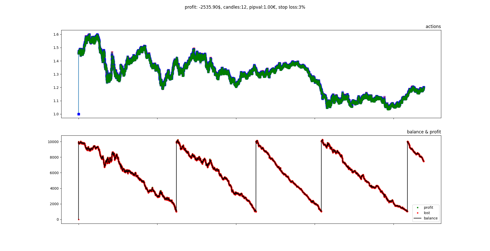
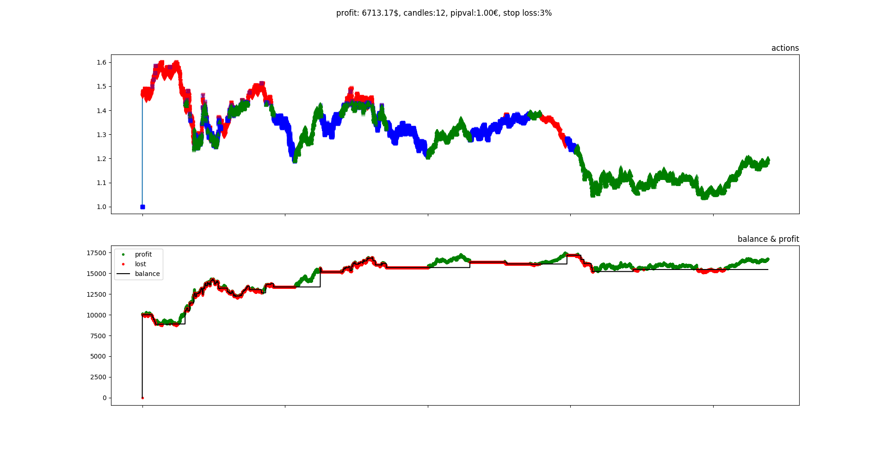
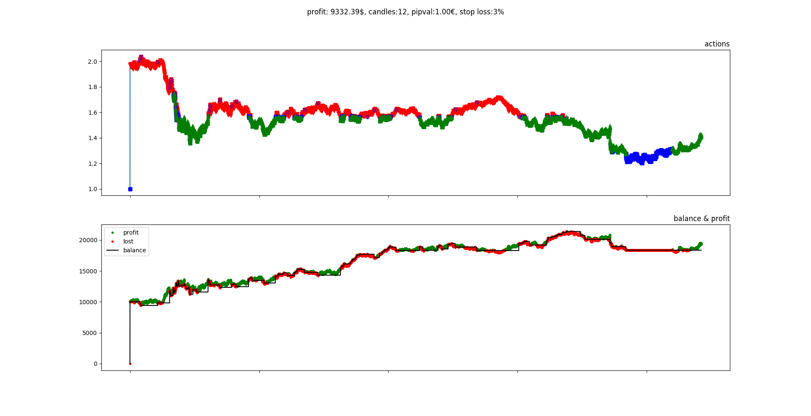

# RL Trading

Reinforcement Learning is most promising for getting Super-Human-Level performance for video games. So why not human 
level on the trading market?

- For conparison, it is always important to check a strategy against a uniform random agent: 
- 2 minute calculation on my laptop give me: 
- 2 further minutes that: 

Is human level reachable?