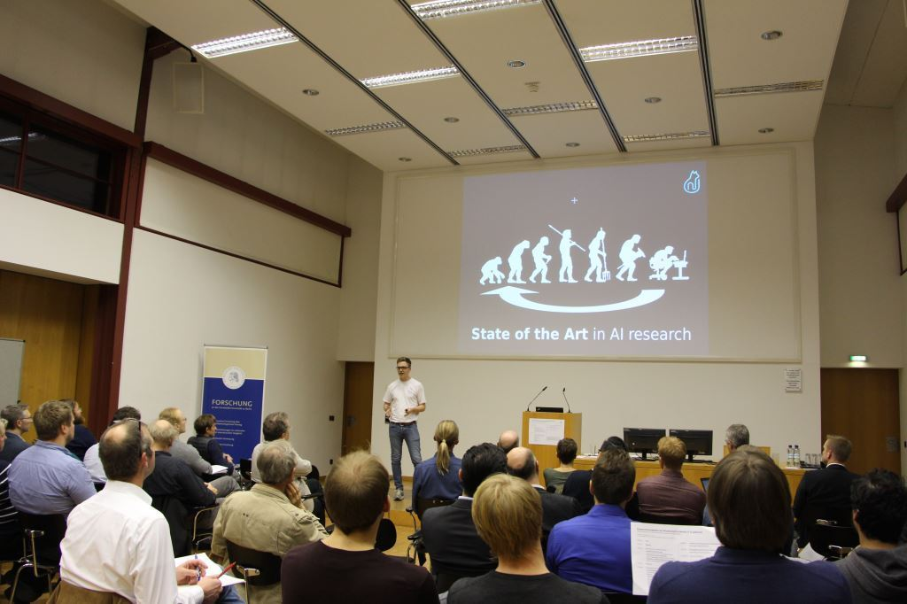
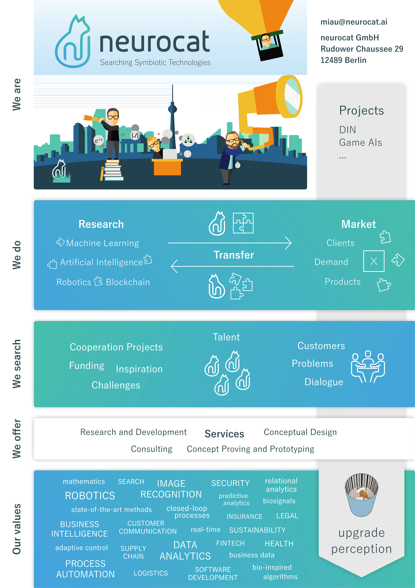

## Humboldt Innovation

[Verantstaltung](https://www.humboldt-innovation.de/de/events/Kooperationsangebote-der-Wissenschaft-im-Bereich-IT-in-Adlershof-261.html) gerockt.

<object data="./nc.pdf" type="application/pdf" width="700px" height="700px">
    <embed src="./nc.pdf">
        This browser does not support PDFs. Please download the PDF to view it: <a href="http://yoursite.com/the.pdf">Download PDF</a>.

    </embed>
</object>

#
Vielen Dank, dass sie der neurocat heute ein offenes Ohr schenken.
Junges Startup, jeder feiert Adlershof drüben im OWZ.

Wir haben uns die Künstliche Intelligenz zur passion gemacht und träumen von Symbiotischen Technologien. Symbiose in Forschung & Anwendung, Software & Hardware, Mensch & Maschine.

#

Oft wird die 4.0 zitiert. Eine KI getriebene Industrielle Revolution.
Die Konzepte, welche hinter der Revolution stehen sind jedoch sehr, sehr alt, aber 

#
Die Vielzahl der Daten, Hardware (CPU, GPU, Sensoren) sind heutzutage erstmals angemessen für die neugetauften "Deep Learning"-Algorithmen.
#
Außerdem richten die großen Fische ihre Segel nach AI first aus.
#
Und die Medien treiben die Technologien in einen Hype.

Es wird über Superintelligenz, Singularität gesprochen.

#

Ich kann aus meiner Perspektive nur schildern, dass wir uns Lichtjahre entfernt von der Singularität, aber nur einen Katzensprung von disruptiven Technologien, sowie Innovationsdiffusion befinden. 

Erfolgsgeschichten wie AlphaGO, Atari DQN, Google Translate overnight improvement zeigen, dass unter der Hype Kurve ein realer Treiber von Wert schlummert.

#

Dennoch dürfen wir nicht naiv werden. Auch die Vielversprechenste Technologie bringt einen Rattenschwanz mit sich.

Wir reden von einer Technologie, die unautorisiert einkäufe tätigt. Zur diskriminierung neigt, manifestiert in einem rassistischen twitter bot und einer Technologie, die schon ein erstes Menschenleben gekostet hat.

#

Und hier kommen wir ins Spiel. Wir glauben nicht an einen kalten AI-Winter. Daher setzen wir uns mit neuen und bewährten KI Algorithmen auseinander.

An Algorithmen mangelts nicht. Viele von denen lassen sich heute schon einfach und effektiv in bestehende Systeme integrieren. Es werden hierfür nur Daten bzw. Sensoren als Treibstoff benötigt.

Wir setzen auf einen mathematischen Fokus, und glauben, dass nur dort die Essenz liegt einen Realismus in Zeiten eines Hypes zu Schaffen und damit einen Mehrwert und Sicherheit zu schaffen für die Innovationsscheue Industrie und Gesellschaft Deutschland.

#

Das Gebiet bewegt sich rasant (hype), wir können es nur erforschen, entwickeln am stand der Zeit und unser Expertenwissen für kleinere Beratungsprojekte benutzen.

#

In welchem Bereich können wir Anwendungen oder Beratungen anbieten?
Wir bieten Algorithmen, welche sich Problemlösungen ausrechnen. Wir benötigen lediglich, Daten bzw. Sensoren als Treibstoff, Domain Knowledge wird vom Kunden mitgebracht.

#

Aber wie können wir dem Kunden Qualität versprechen?
Denn wir sind die initiatoren für einen DIN Standard für Prüf- und Bewertungsverfahren von KI Software. Das Programmierparadigma hat sich geändert. In 4.0 braucht Software 2.0 ein neues 25000.

#

Warum sollten wir sowas machen?

In erster Linie, wollen wir Qualität, statt black-magic.
Wir wollen vertrauen aufbauen für die Innovationsscheuen unter uns. 
Wir glauben wirtschaftswachstum braucht Regelwerk. Wir wollen Innovationen pushen, aber gezielt und wissenschaftlich. 
Außerdem ist dies eine große Chance sein Realismus in Zeiten eines Hypes zu zeigen und den Realwert der Technologien zu Stützen.
#

Glücklicherweise stehen wir damit nicht alleine da. Wir sind froh, dass wir solch eine große Resonanz  erzeugen konnten.
Wir starten momentan mit Taxonomie und gehen anschließend in Risikomanagement über

#

Zurück zu uns. 
Wir haben einen Standard initiiert, wir suchen kooperation. So klein wir auch sind, haben wir großes Engagement.
Um unser engagement füttern zu können brauchen wir.
Geld und Mitarbeiter sowieso. Sehr gerne reden wir über synergien 

#

Aber vorallem sind wir heute hier um Projekte und inspirationen zu erhalten. Wir wollen den Standard am Markt entwickeln und nicht an ihm vorbei. Deshalb sammeln wir gerne weiter Erfahrung und beweisen Ihnen, dann intelligente Algorithmen keine zukunftsvisionen sind, sondern auch heute schon in Ihr System integriert werden kann, 

Es bedarf nur ein Problem, Daten(Sensoren) in denen eine Problemlösung schlummert. Ihr Domainwissen. Wir probieren die Problemlösung aus den Daten zu extrahieren.
