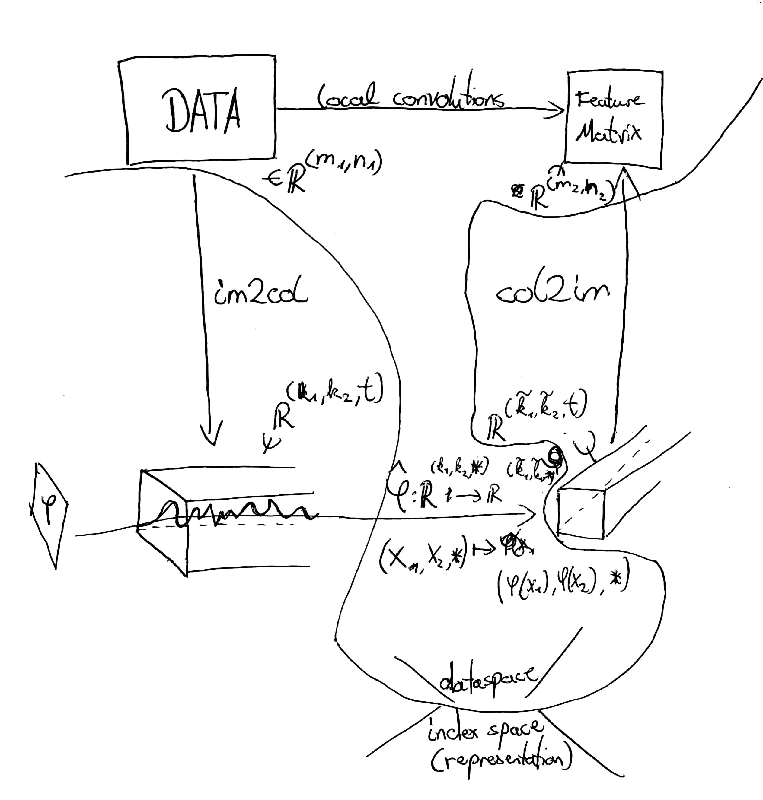
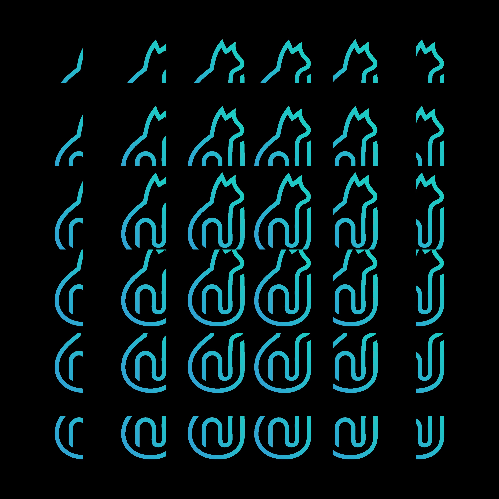
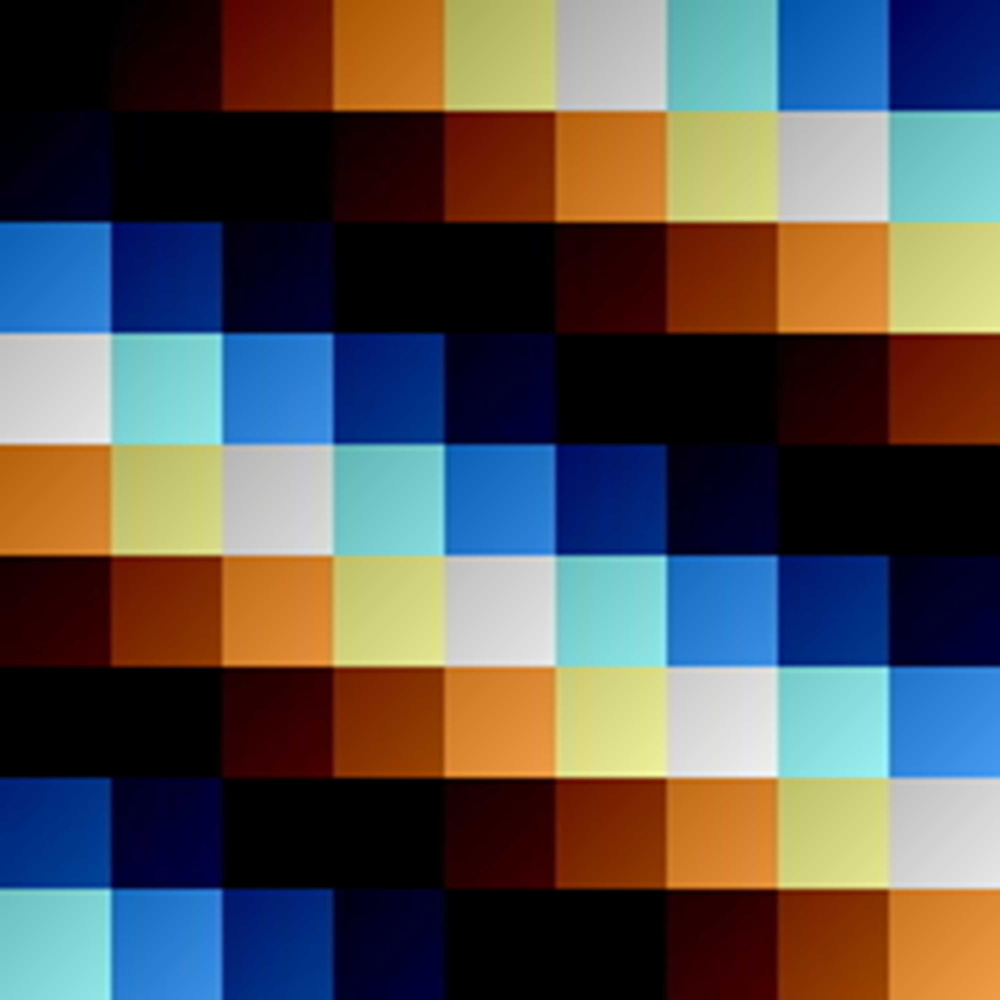

## Discrete Data Hyper Cuboids

Explainations follow....

Creates for 2D the following output.

- sliding through time ND first good approach for explaining can be [tappings](/home/float/Pictures/tmp/Neues Dokument 2018-01-10.jpg) by Oswald Berthold.
- sliding through Image Tensor projection (2D) 
- sliding through RGB Tensor (3D) 

My Algorithm is invariant of Dimension and blows up the index space, rather then looping through with blood.

The Algorithm can be used as timeembedding, CNN, as well as embeddings of any kind.
