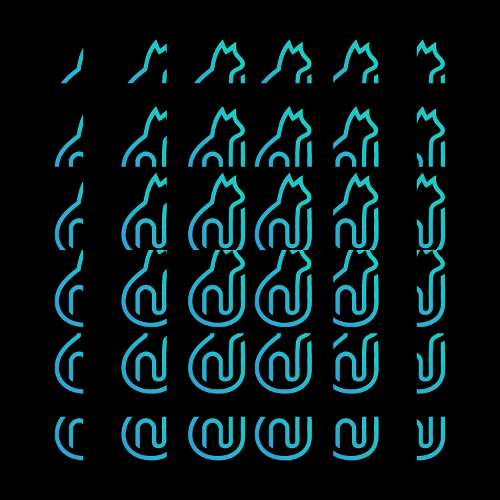
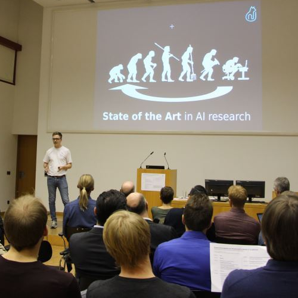
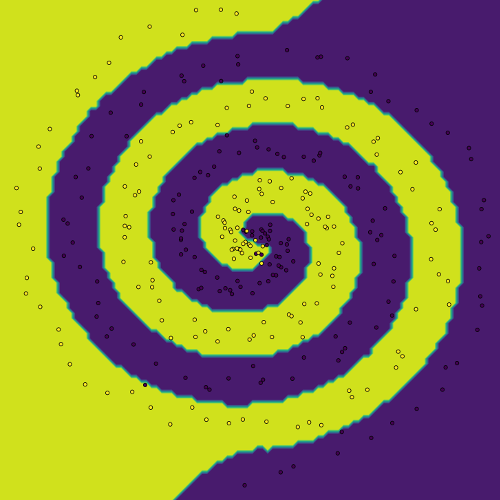
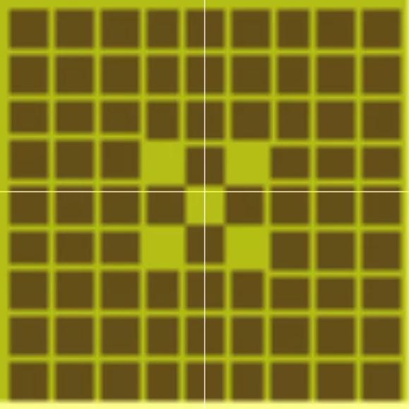

## Projects               

### 180215 Linear Music Generation
 

### 180214 Lecture Clustering
 

### 180212 Positive,Negative?
 

### 180210 RLTradingv0.75
 

### 180120 k-Means
  

### 180108 Im2Col
  

### 171211 Music Generation         
 

### 171205 Ridge Kernels               
  

### 171128 Predictive Maintainance
          

### 171114 Humboldt Innovation 
   

### 171106 k-Nearest Neighbor
               

### 171023 AI Safety Kickoff DIN Institute
    

### 171009 Prioritized Experience Replay
  

### 170918 SnaKI      
   

### 170814 Tensorflow MLP        
 

### 170812 Tensorboard
  

### 170811 Tensorflow basics        
  

     

*Build on neurocat toolbox. Copyright accordingly.*
