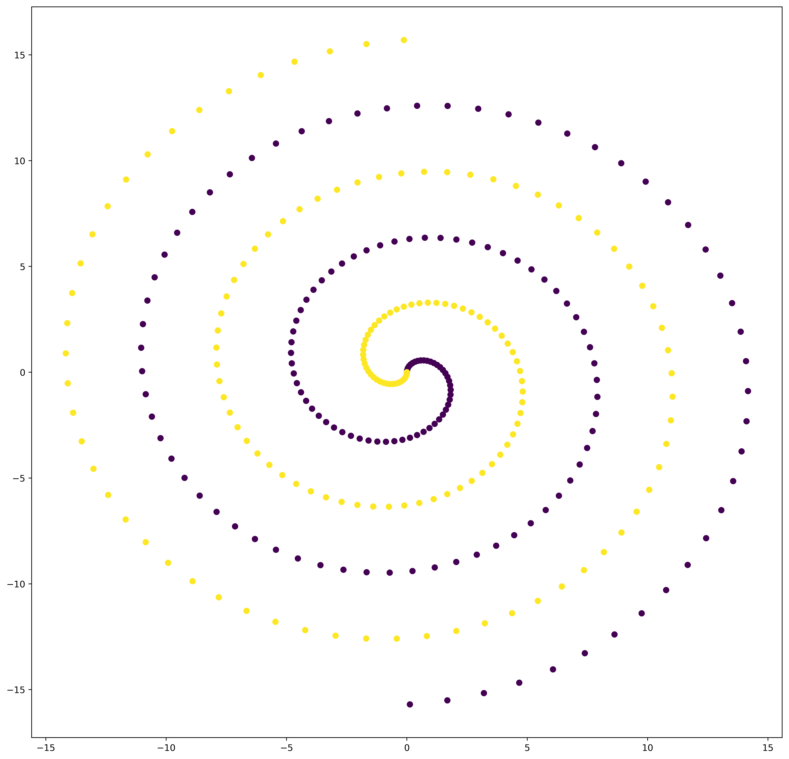
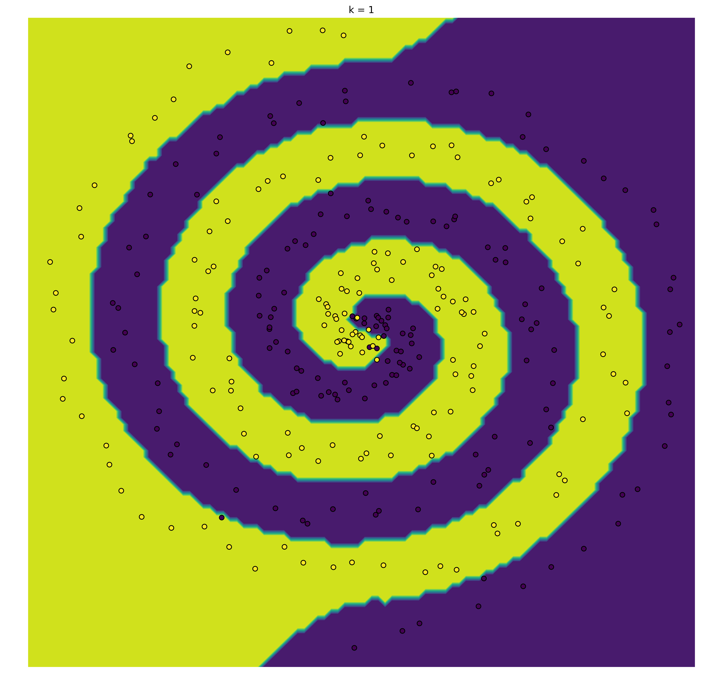
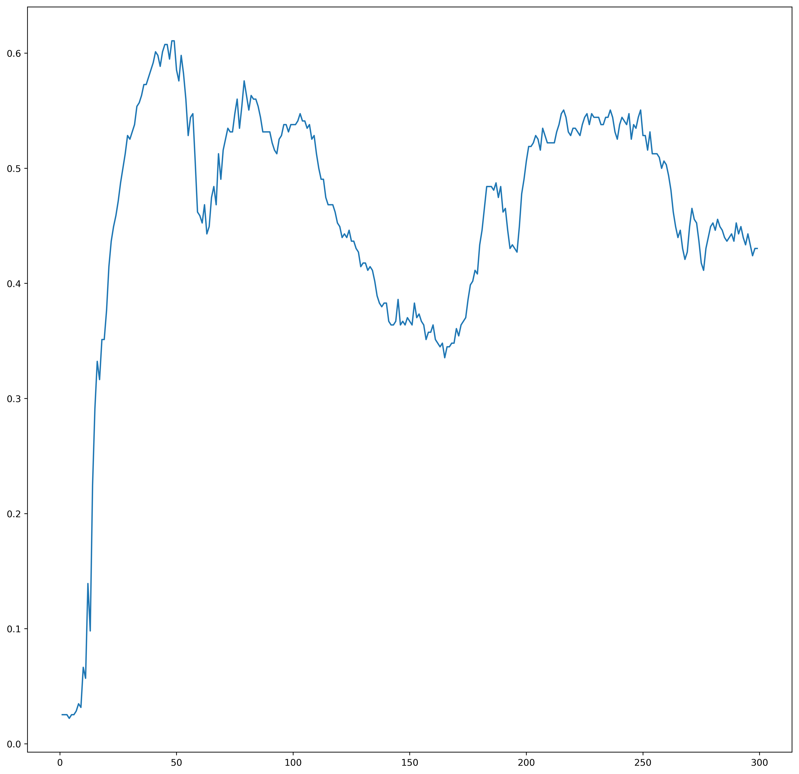

# Nearest Neighbors Classification

<iframe width="560" height="315" src="https://www.youtube.com/embed/D1VlsqYgkL4" frameborder="0" allow="autoplay; encrypted-media" allowfullscreen></iframe>

## Task
ML Jähnichen HU Berlin

>Implement the k-nearest neighbor learning algorithm in a programming language of your
choice (preferably Python or Julia and in a notebook). Test the algorithm:
1. Generate two-dimensional training data and test data coming from two classes.
1. Run the algorithm.
1. Plot the result as a 2D figure. Use colors (or shapes) to illustrate the results.
1. Find the KNN decision boundary (i.e. where is the boundary where the algorithm de-
cides for either class 1 or class 2) and plot it.
1. Repeat your experiment for different K . How does the KNN decision boundary beha-
ve? What is the best K and why? Hint: Compute the empirical loss for different k. Use
the indicator loss function for this. Plot the loss versus k. What do you observe?

Before starting we will need some preconfiguration.


```python
% matplotlib inline
import numpy as np
import matplotlib as mpl
import matplotlib.pyplot as plt
mpl.rcParams['figure.figsize'] = (15,15)
mpl.rcParams['figure.dpi'] = 500
```

## 3.1 Dataset

We decided to take a dataset with two spirals hopelessly in love, seperated by a kNN algorithm. The two classes are labeled 0 and 1, respectively.
A spiral is depending on some parameters.


```python
_x = np.arange(0, 5 * np.pi, 0.1)
class_size = _x.shape[0]
```

### Training Data

Knowing properties of sinus, we easily can create a spiral:


```python
train = np.empty(shape=(2 * class_size, 3))

# first class
train[:class_size] = np.concatenate(
    [(_x * np.sin(_x))[:, None],
     (_x * np.cos(_x))[:, None],
     np.zeros(shape=_x.shape)[:, None]],
    axis=1
)

# second class
train[class_size:] = np.concatenate(
    [-(_x * np.sin(_x))[:, None],
     -(_x * np.cos(_x))[:, None],
     np.ones(shape=_x.shape)[:, None]],
    axis=1
)

# extract datapoints and labels
X_train = train[:, :2]
y_train = train[:, -1].astype(np.int64)

# first impression of dataset
plt.figure()
plt.scatter(X_train[:, 0], X_train[:, 1], c=y_train)
plt.show()
```





### Test Data

For the test data, we will be adding noise to every datapoint coordinate.


```python
# create noise
noise = np.random.randn(2 * class_size, 2) / 2

# add noise to training data
X_test = X_train + noise
y_test = y_train
```

## 3.2 Implement the kNN Algorithm


```python
class kNN:
    def __init__(self, X, y):
        """
        Provide training data.
        Suspecting datapoints X and labels y of the form
        :param X: numpy array shape=(?,2), dtype=np.float64
        :param y: numpy array shape=(?,), dtype=np.int64
        """
        self.X = X
        self.y = y

    def predict(self, k, points):
        """
        Predicting as k-Nearest neighbor classifier for the given (data) 
        points.
        :param k: integer, representing the k nearest neighbors
        :param points: numpy array of shape=(?,2)
        :return: numpy array of shape=(?,) representing classes
        """
        # preallocate class predictions
        _y = np.empty(shape=points.shape[0])
        
        for i, p in enumerate(points):
            # distance from points and training dataset X
            _d = np.linalg.norm(self.X - p, axis=1)
            # get k smallest indices
            near = _d.argsort()[:k]
            # count occurrence of class values
            counts = np.bincount(self.y[near])
            # save the most frequent class
            _y[i] = np.argmax(counts)
        # return the predictions
        return _y
```

## 3.(3/4) Run Algorithm with vizualization

### Visualization

We will visualise the algorithm by predicting the class for each point in a meshgrid. The membership to a class is represented by a unique color. With that approach we can easily plot the decision boundary.  
Finally we compute the algorithm for each datapoint in the test data and add the points to the plot with coresponding class color.

Notice that this method can easily switch between k's and refinements.


```python
def plot(knn, X, y, shape=(1, 1), step_size=1, refinement=100):
    """
    Run kNN algorithm with visualization
    :param knn: kNN object
    :param X: test data
    :param y: test labels
    :param shape: shape of the plot grid. Each grid element is representing
    a k.
    :param step_size: increasing number for k in each plot grid element
    :param refinement: refinement for decision boundary
    :return: list, evaluation of empirical loss for every k
    """
    # determine the range of the datapoints
    x_min, x_max = X[:, 0].min() - 1, X[:, 0].max() + 1
    y_min, y_max = X[:, 1].min() - 1, X[:, 1].max() + 1

    # determine refinement of meshgrid
    h = [(x_max - x_min) / refinement, (y_max - y_min) / refinement]

    # establish grid plot
    fig, axs = plt.subplots(*shape)
    fig.figsize = (18,18)
    axs = np.ravel(axs)

    # collector for loss
    loss = []

    for j, k in enumerate(range(1, (shape[0] * shape[1])*step_size+1, step_size)):
        # meshgrid ------------------------------------------------------------

        # create mesh for boundary evaluation
        xx, yy = np.meshgrid(np.arange(x_min, x_max, h[0]),
                             np.arange(y_min, y_max, h[1]))
        # predict the classes
        Z = knn.predict(k, np.c_[xx.ravel(), yy.ravel()])
        Z = Z.reshape(xx.shape)

        # visualise -----------------------------------------------------------

        # create a contour plot, with a separating decision boundary
        axs[j].contourf(xx, yy, Z)

        # Plot also the test points with corresponding class color
        axs[j].scatter(X[:, 0], X[:, 1], c=y, edgecolor='k')
        # label sup plot
        axs[j].set_title("k = %i" % k)

        # some aesthetics
        axs[j].axis('off')

        # determine loss ------------------------------------------------------
        _loss = np.mean(np.abs(knn.predict(k, X) - y))
        loss+=[(k,_loss)]

    plt.show()

    return loss

```

### Run Algorithm


```python
knn = kNN(X_train, y_train)

plot(knn, X_test, y_test)
```





    [(1, 0.025316455696202531)]


## 3.5 Compare K

We will compare some K's for the algorithm with the following method


```python
def compareK(knn, X, y, start=1, stop=100, step=1):
    """
    Compare kNN for different k
    :param knn: kNN object
    :param X: test data
    :param y: test labels
    :param start: minimal k
    :param stop: maximal k
    :param step: step between k
    """
    ks = []
    losss = []
    min_loss = float('inf')
    best_k = 0
    for k in range(start, stop, step):
        _loss = np.mean(np.abs(knn.predict(k, X) - y))
        if _loss < min_loss:
            min_loss = _loss
            best_k = k

        ks.append(k)
        losss.append(_loss)

    plt.figure()
    plt.plot(ks, losss)
    plt.show()

    return best_k, min_loss

compareK(knn, X_test, y_test, stop=300)
```





    (4, 0.022151898734177215)


Apparently k=1 is the best choice for this dataset. Lets visualize increasing k:


```python
plot(knn, X_test, y_test, shape=(5, 5), step_size=2)
```


    [(1, 0.025316455696202531),
     (3, 0.025316455696202531),
     (5, 0.025316455696202531),
     (7, 0.028481012658227847),
     (9, 0.031645569620253167),
     (11, 0.056962025316455694),
     (13, 0.098101265822784806),
     (15, 0.29113924050632911),
     (17, 0.31645569620253167),
     (19, 0.35126582278481011),
     (21, 0.41455696202531644),
     (23, 0.44936708860759494),
     (25, 0.47151898734177217),
     (27, 0.5),
     (29, 0.52848101265822789),
     (31, 0.53164556962025311),
     (33, 0.55379746835443033),
     (35, 0.56329113924050633),
     (37, 0.57278481012658233),
     (39, 0.58544303797468356),
     (41, 0.60126582278481011),
     (43, 0.58860759493670889),
     (45, 0.60759493670886078),
     (47, 0.59493670886075944),
     (49, 0.61075949367088611)]


### Evaluation

We believe that the best k is completly depending on the dataset. In this spiral dataset we notice that the datapoints near to the peripherie get more unimportant for increasing k. Furthermore for a class with less points then k it is impossible to get relevant results for these class predictions.
On the other hand, a highly noised dataset can profit from increasing k.

Overall, when you don't have a complete mathematical knowledge about the dataset, crossvalidation is the reference point for determining k.

Thank you very much for your time and passion.

Kind regards,

Assion & Greßner
