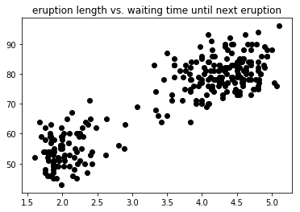
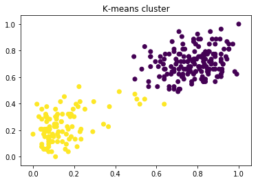
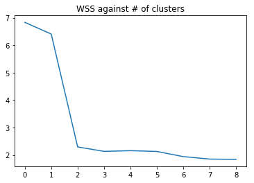

## Implementing K-Means
ML Jähnichen HUB

### prerequisites

```python
import numpy as np
import pandas as pd
from matplotlib import pyplot as plt
```

### Data


```python
def old_faithful():
    filename = "data.tsv"

    # read file
    df = pd.read_csv(filename, delimiter=r"\s+", skiprows=0, header=0)

    # delete unimportant columns
    df = df.drop(['idx'], axis=1)

    # normalize
    normal = df.as_matrix()
    normal = (normal - normal.min(axis=0))/normal.ptp(axis=0)

    return df.as_matrix(), normal

data, _data = old_faithful()
```

### Visualization


```python
def vis(data, assign='black'):
    if assign is 'black':
        title = "eruption length vs. waiting time until next eruption"
    else:
        title = "K-means cluster"

    plt.scatter(data[:, 0], data[:, 1], c=assign)
    plt.title(title)

    plt.show()

vis(data)
```





### Clustering


```python
class KMeans:
    """
    Implement K-means algorithm

    :param K: hyperparameter - number of clusters
    :param X: data numpy matrix, every row one data point
    """

    def __init__(self, K, X):
        self.K = K
        self.X = X

    def __len__(self):
        """number of data points"""
        return len(self.X)

    def fit(self):
        # place cluster centers randomly for all K
        centres = np.random.uniform(0, +1, size=(self.K, 2))          # cluster centres
        infer = np.zeros(len(self))                                   # vector with corresponding cluster for X

        while True:
            _centres = centres.copy()

            for i, p in enumerate(self.X):                            # assign datapoints to nearest cluster
                # distance from points and cluster centers
                _d = np.linalg.norm(centres - p, axis=1)

                # get indice with smallest distance
                infer[i] = _d.argmin()
                # todo filter nan

            for j in range(self.K):                                  # recompute cluster centres
                _center = np.mean(self.X[infer == j])
                if _center == _center:  # nan check
                    centres[j] = _center

            if np.max(centres-_centres) < 1e-8:                        # check convergence
                break

        return infer, centres
    
kmean = KMeans(2, _data)
label, _ = kmean.fit()

vis(_data, label)
```





### within-cluster sum of squares


```python
def wss(data, centres, labels):
    norm = np.linalg.norm(centres[labels.astype('int')] - data)
    sum = np.sum(norm)

    return sum

def b(bound=10):
    measures = np.zeros(bound -1)

    for i in range(1, bound):
        kmean = KMeans(i, _data)
        labels, centres = kmean.fit()
        measures[i-1] = wss(_data, centres, labels)

    plt.plot(measures)
    plt.title("WSS against # of clusters")

    plt.show()

b()
```

    /home/float/.local/lib/python3.5/site-packages/numpy/core/fromnumeric.py:2909: RuntimeWarning: Mean of empty slice.
      out=out, **kwargs)
    /home/float/.local/lib/python3.5/site-packages/numpy/core/_methods.py:80: RuntimeWarning: invalid value encountered in double_scalars
      ret = ret.dtype.type(ret / rcount)




