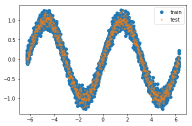
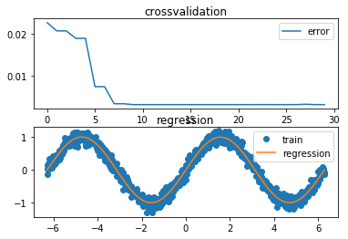
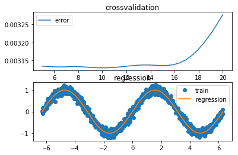

# Excercise Sheet 5

## Task 2

>Compare different ridge regression algorithms. In general, the ridge regression cost function is given by
$$J(\theta)=(Y-\Phi(X)\theta)^{T}(Y-\Phi(X)\theta)+\delta\theta^{T}\theta$$
Interpreted as an ordinary optimization problem, we can consider different settings for $\Phi(\cdot)$.
- If Φ(·) is the identity function. we obtain simple linear regression.
- If Φ(·) transforms single $X_{i}$ into a vector of polynomials of $X_{i}$ , we obtain polynomial regression.
- If Φ(·) defines a set of radial basis functions that transform the input $X_{i}$ and the number of bases is equal to the number of examples, we obtain kernel regression.


```python
# satisfying this task we will need
import numpy as np
import matplotlib.pyplot as plt
import time # fun sake
```

## part a
>Generate a simple training data set, e.g. take the sine wave and add zero-mean unit-variance Gaussian noise to it, i.e. generate according to $y_{i} = \sin(x_{i}) + \epsilon, \epsilon  N(0, 1) $ . Important is, that the underlying function is non-linear.

For fullfilling the task **(a)** we will create a test and training set with the distribution given in the excercise:


```python
n_train = 5000
n_test = 1000

def data_gen(n, order=False):
    """
    Generates test/training set and labels - sinus curve + noise
    :param n: size of array
    :return: x = np.array(1,n), y = np.array(1,n)
    """
    if not order:
        x = np.random.uniform(-2 * np.pi, 2 * np.pi, size = n)
    else:
        x = np.linspace(-2 * np.pi, 2 * np.pi, num = n)

    σ = 0.1 * np.random.randn(n)
    y = np.sin(x) + σ

    return x, y

def exc_a():
    # generate training and test set respectively
    x_train, y_train = data_gen(n_train, order=False)
    x_test, y_test = data_gen(n_test, order=True)

    # plot the damn thing
    plt.plot(x_train, y_train, 'o', label='train'), plt.plot(x_test, y_test, '.', alpha=0.4, label='test') 
    plt.legend()
    plt.show()
    
    return x_train, y_train, x_test, y_test
    
s = time.time()
x_train, y_train, x_test, y_test = exc_a()
print("time needed for (a):", time.time()-s, "sec")
```





    time needed for (a): 0.2388453483581543 sec


## preface (a) & (b)
Both the following tasks, ask for exploitation of different regressors. The regressor differ in their designmatrix and hyperparameter for crossvalidation. So we created a linear regressor class, that allows to inherit basic functionalities for linear regression modells with optional adaption of the designmatrix and hyperparameter for subclasses.


```python
class Reg():
    def __init__(self, X, y):
        """
        Establish a regressor with given data points
        :param X: data points, np.array(N, features)
        :param y: labels, np.array(N,)
        """
        self.θ = np.zeros(1 + 1)
        self.δ = 0.005
        self.x_train = X
        self.X = self.des_mat(X)
        self.Y = y.T

    def des_mat(self, X):
        """
        Converts row vector X=shape(n,) into design matrix
        :param X: takes data set as row vector
        :return: design matrix np.array((n, 2))
        """
        power_cols = np.power(X[:, None], np.arange(1 + 1))
        return power_cols

    def LSE(self):
        """
        Calculates least square solution and saves it in self.θ
        """
        A = np.dot(self.X.T, self.X) + self.δ * np.eye(self.θ.shape[0])
        b = np.dot(self.X.T, self.Y)
        self.θ = np.linalg.solve(A, b)

    def predict(self, X):
        """
        Predicts values for inserted data row
        :param X:  data set as row vector np.array(1,n)
        :return: row vector np.array(1,n)
        """
        X = self.des_mat(X)
        pred = np.dot(X, self.θ)
        return pred.T

    def error(self, X, y):
        """
        Measures accuracy of prediction vs. labels via mean squared error
        :param X:  data set as row vector np.array(1,n)
        :param y:  labels as row vector np.array(1,n)
        :return: float, accuracy level
        """
        n = len(X)
        pred = self.predict(X).T
        Y = y.T
        err = 1 / n * np.linalg.norm(Y - pred)
        return err
```

Additionally the following task ask for crossvalidation, with is achieved by the following method. Please note that the regressor is exchangable.


```python
def cross_validation(Δ, X, y, k=5, regressor=PolReg):
    """
    k-fold cross validation for polynomial regression or kernel regression
    :param Δ: tuple (float) of polynomial degrees or lambdas
    :param X: data points, np.array(N, features)
    :param y: labels, np.array(N,)
    :param k: integer that specifies the foldedness of the cross validation
    :param regressor: child of Reg with existing parameter for cross-validation
    :return: np.array filled with mean accuracy
    """

    # placeholder for evaluating cross validation
    eva = np.zeros(shape=(k, len(Δ)))

    # we must shift the indices for 5 fold below
    shifter = int(1 / k * len(X))
    for j in range(k):
        for i, h in enumerate(Δ):
            shift = j * shifter

            # get local training and test set
            _x, _y = map(lambda d:
                         np.roll(d, shift),

                         [X, y])

            _x_train, _y_train = map(lambda d:
                                     d[shifter:],

                                     [_x, _y])

            _x_test, _y_test = map(lambda d:
                                   d[:shifter],

                                   [_x, _y])

            _reg = regressor(_x_train, _y_train, h)
            _reg.LSE()
            eva[j, i] = _reg.error(_x_test, _y_test)

    return np.mean(eva, axis=0)
```

Finaly, also the visualization is invariant of its regressor:


```python
def cross_val_viz(Δ, err, x_test, y_test, y_reg):
    fig = plt.figure()
    ax1 = fig.add_subplot(211)
    ax1.set_title("crossvalidation")
    plt.plot(Δ, err, label='error')
    plt.legend()
   
    ax2 = fig.add_subplot(212)
    ax2.set_title("regression")
    plt.plot(x_test, y_test, 'o', label='train'), plt.plot(x_test, y_reg, label='regression') 
    ax2.legend()
    
    plt.show()
```

## part b
>Fit a polynomial regression to the data set and visualize its predictions. Determine the degree by cross-validation.

First of all we need to inherit basic functionalities, add hyperparameter and adapt the designmatrix with respect to polynomial regression. This is achieved with the following class:


```python
class PolReg(Reg):
    """
    Instantiate a polynomial regressor with given data points
    :param X: data points, np.array(N, features)
    :param y: labels, np.array(N,)
    """

    def __init__(self, X, y, deg=1):
        self.deg = deg
        Reg.__init__(self, X, y)
        self.θ = np.zeros(self.deg + 1)

    def des_mat(self, X):
        """
        Converts row vector x=shape(1,n) into polynomial regression design matrix
        :param X: takes data set as row vector
        :return: design matrix np.array((n, deg +1)) or np.array((n,len(µ))
        """
        power_cols = np.power(X[:, None], np.arange(self.deg + 1))
        return power_cols
    
def exc_b():
    # choose the range of values for crossvalidation
    Δ = np.arange(30)

    # get accuracies from the different Δ values
    err = cross_validation(Δ, x_train, y_train, k=5, regressor=PolReg)

    # get the best index
    bst_deg = Δ[np.argmin(err)]
    print("Best degree for polynomial regression: ", bst_deg)

    # solve least square solution and get prediction
    _pol = PolReg(x_train, y_train, deg=bst_deg)
    _pol.LSE()
    y_reg = _pol.predict(x_test)
    
    # plot results
    cross_val_viz(Δ, err, x_test, y_test, y_reg)

s = time.time()
exc_b()
print("time needed for (b):", time.time()-s, "sec")
```

    Best degree for polynomial regression:  11





    time needed for (b): 2.10097336769104 sec


## part c
>Fit a kernel regression to the data. Use radial basis functions of the form 
$$\kappa(X_{i},\mu_{j},\lambda)=\exp(\dfrac{1}{\lambda}\begin{Vmatrix}
X_{i}-\mu_{j}
\end{Vmatrix}^2)$$
for each $X_{i}$ consider basis functions $\kappa$ with means $\mu_{j}=X_{j}$ , j = {1, ... , n}. Determine λ using cross-validation and visualize your results.

So same, same but different regressor


```python
class KerReg(Reg):
    def __init__(self, X, y, λ=1, µ=np.linspace(-2 * np.pi, 2 * np.pi, 20)):
        """
        Instantiate a kernel regressor with given data points
        :param X: data points, np.array(N, features)
        :param y: labels, np.array(N,)
        """
        self.λ = λ
        self.µ = µ
        Reg.__init__(self, X, y)
        self.θ = np.zeros(len(self.µ))

    def des_mat(self, X):
        """
        Converts row vector x=shape(1,n) into design matrix
        :param X: takes data set as row vector
        :return: design matrix np.array((n, deg +1)) or np.array((n,len(µ))
        """
        # radial basis function:
        # κ(X, µ, λ) = exp(1/λ|| X - µ ||²)
        # exp(
        X = np.exp(
            # 1/λ
            -1 / self.λ
            # || x - µ ||²)
            * np.abs(
                X[:,None] - self.µ) ** 2
        )
        return X
    
def exc_c():
    # choose the range of values for crossvalidation
    Δ = np.linspace(5, 20, 30)

    # get accuracies from
    err = cross_validation(Δ, x_train, y_train, k=5, regressor=KerReg)

    # get the best index
    bst_λ = Δ[np.argmin(err)]
    print("Best lambda for kernel regression: ", bst_λ)

    _ker = KerReg(x_train, y_train, λ=bst_λ)
    _ker.LSE()
    y_reg = _ker.predict(x_test)
    
    # plot results
    cross_val_viz(Δ, err, x_test, y_test, y_reg)

s = time.time()
exc_c()
print("time needed for (c):", time.time()-s, "sec")
```

    Best lambda for kernel regression:  10.1724137931





    time needed for (c): 1.5013198852539062 sec


Thanks and best  
**Assion & Greßner**
