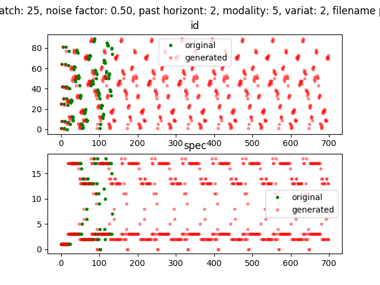
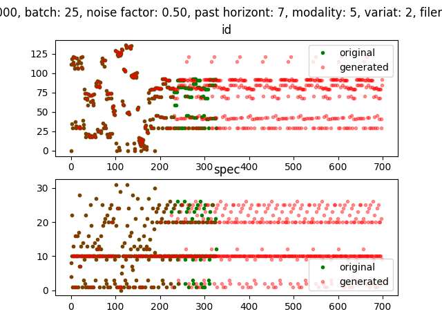

## Simpler Music Generator

- **Input**: Musical Instrument Digital Interface (MIDI)
- **Processing**: Classification Blackbox. 
- **Output**: autoregressive model predicting its environment.

This is a new approach for my music generator [version 1](../musicgen). This model is much simpler, more accurate, but less creative. Practically no training time (compared to version 1). 
When past horizont big enough a music peace can be completely imitated by the model. When making horizont smaller, some infinite patterns emerge. I searched for hyperparameters that result a harmonic sound loop.

### Pachelbel Canon

#### Original
<audio controls="controls">
  <source type="audio/wav" src="./pachelbel_canon.wav"></source>
  
Your browser does not support the audio element.

</audio>

#### Generated
<audio controls="controls">
  <source type="audio/wav" src="./nc_pachelbel_canon02.wav"></source>
  
Your browser does not support the audio element.

</audio>

### Tetris

#### Original
<audio controls="controls">
  <source type="audio/wav" src="./tetris.wav"></source>
  
Your browser does not support the audio element.

</audio>

#### Generated
<audio controls="controls">
  <source type="audio/wav" src="./nc_tetris.wav"></source>
  
Your browser does not support the audio element.

</audio>

unfortunally without pictures, too late for now

### Star Wars Theme

#### Original
<audio controls="controls">
  <source type="audio/wav" src="./starwars.wav"></source>
  
Your browser does not support the audio element.

</audio>

#### Generated
<audio controls="controls">
  <source type="audio/wav" src="./nc_starwars.wav"></source>
  
Your browser does not support the audio element.

</audio>

### Elise

#### Original
<audio controls="controls">
  <source type="audio/wav" src="./elise.wav"></source>
  
Your browser does not support the audio element.

</audio>

#### Generated
<audio controls="controls">
  <source type="audio/wav" src="./nc_elise.wav"></source>
  
Your browser does not support the audio element.

</audio>

