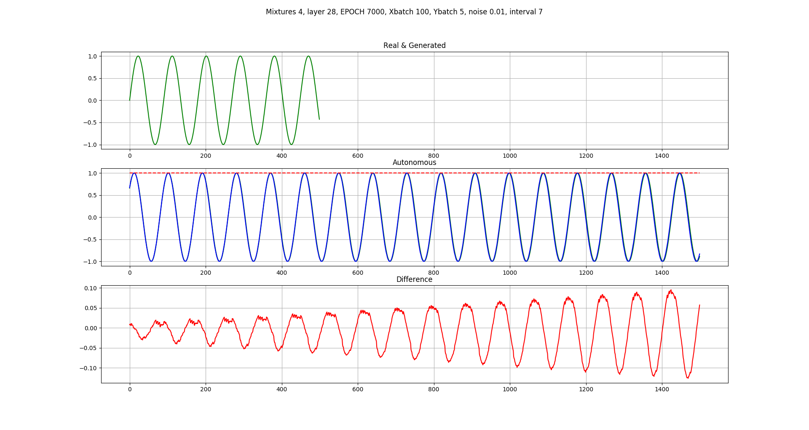
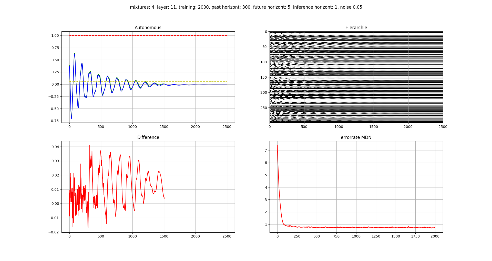
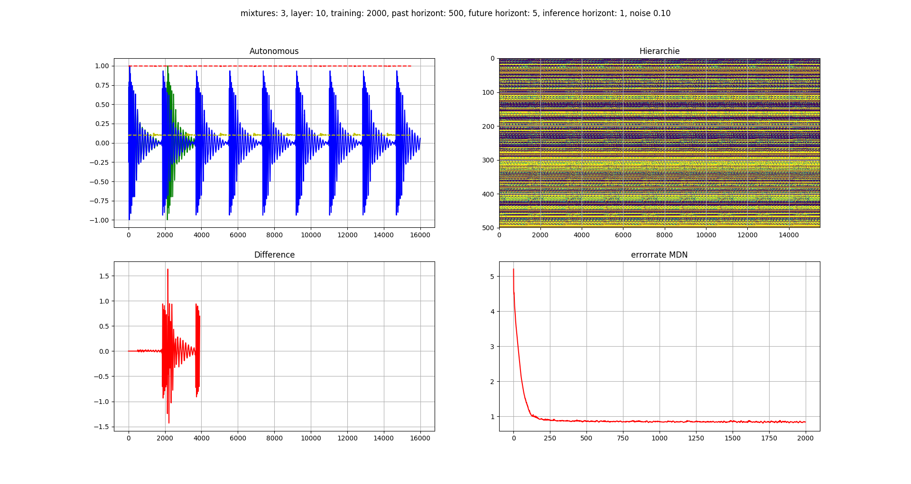
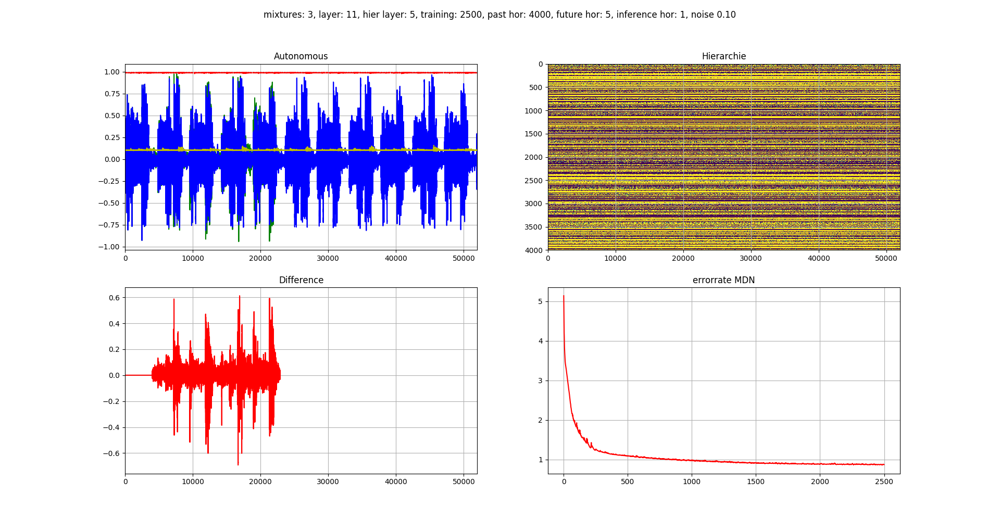

# Music Generator

## WAV soundwaves

I build a Mixture Density Model from Christopher Bishop into a Tensorflow computation graph.

### Computation Graph

### Sinus

With that I solved toyproblems, like generating Sinus

### drum

#### original
<audio controls="controls">
<source type="audio/wav" src="./old_thesis/drums.wav"></source>

Your browser does not support the audio element.

</audio>

#### generated
<audio controls="controls">
  <source type="audio/wav" src="./old_thesis/gen_drums.wav"></source>
  
Your browser does not support the audio element.

</audio>

### rap

#### original
<audio controls="controls">
<source type="audio/wav" src="./old_thesis/rap.wav"></source>

Your browser does not support the audio element.

</audio>

#### generated
<audio controls="controls">
  <source type="audio/wav" src="./old_thesis/rap_gen.wav"></source>
  
Your browser does not support the audio element.

</audio>

## MIDI

Less complex, more efficient results

Input: Midi. Density function approximation. Output autoregressive model predicting its environment.

### Starwars

My favorite (from 1.5min+). So much different from the original.

#### original
<audio controls="controls">
<source type="audio/wav" src="http://florens.io/projects/linmusicgen/starwars.wav"></source>

Your browser does not support the audio element.

</audio>

#### generated
<audio controls="controls">
  <source type="audio/wav" src="./nc_starwars_001.wav"></source>
  
Your browser does not support the audio element.

</audio>

### Scale A major

Simple music basics for the agent to learn with interesting result. Maybe one has to give the agent music patterns and no music pieces...

#### original
<audio controls="controls">
<source type="audio/wav" src="./scale_a_major.wav" ></source>

Your browser does not support the audio element.

</audio>

#### generated
<audio controls="controls">
  <source type="audio/wav" src="./nc_scale_a_major.wav"></source>
  
Your browser does not support the audio element.

</audio>

### Tetris

Very exciting, it is archived as the first working descision process.

#### original
<audio controls="controls">
<source type="audio/wav" src="http://florens.io/projects/linmusicgen/tetris.wav"></source>

Your browser does not support the audio element.

</audio>

#### generated
<audio controls="controls">
  <source type="audio/wav" src="./nc_tetris001.wav"></source>
  
Your browser does not support the audio element.

</audio>

