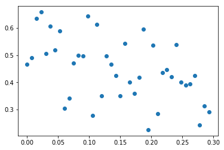
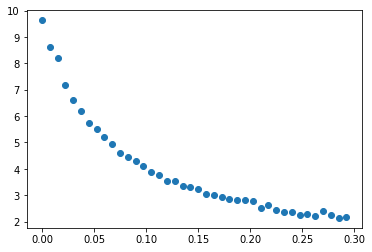

# Excercise Sheet 4

## Task 4

>Download the Spambase data set. Your task is to classify emails into spam or not-spam
(sometimes called ham) emails. There are of course sophisticated methods to do this, but
we will look into logistic regression again.

>**(a)** Use a suitable library to load the data. Compile a training set and a test set from the
data. A description of the available features (input dimensions) is given in spamba-
se.names. Most of the data are in the [0, 100] interval but some are not normalized.
More info in the spambase.names file.

As requested, we will first of all import some suitable libraries:


```python
from pandas import read_table # to read the datafile,
import numpy as np # to handle the content and
import matplotlib.pyplot as plt # to plot crossvalidation in part c)
```

Now, we can import and adapt the data set. To work with the data it has to be preprocessed:


```python
def prepro(X):
    """
    Assuming float numpy array with the following coordinates
    :param X: Numpy of shape=(data, dim), where 'data' represents the amount of
    datapoints and 'dim' represents the dimensionality of the data
    :return: zero centered and normed representation of X
    """
    # range 'peak to peak'
    ptp = X.ptp(axis=0)
    cent = X - ptp / 2
    norm = 2 * cent / ptp
    return norm
```

Thats all we need. Let's solve (a):


```python
def exc_a(proportion=0.2):
    """
    Solve Exercise (a)
    :param proportion, float, proportion training-test set
    :return: x_train, x_test, y_train, y_test, data and labels for training
    and test data, respectively
    """
    # extract data
    spam = read_table('spambase.data', sep=',')

    # convert to numpy
    np_spam = spam.as_matrix()

    # before split labels from arguments, destroy order to avoid bias
    np.random.shuffle(np_spam)

    # determine the index seperating training and testset
    num_test = int(np_spam.shape[0] * proportion)

    # divide training and test data
    _train, _test = np_spam[num_test:], np_spam[:num_test]

    # divide training from test set
    Xytrain, Xytest = map(lambda x: [x[:, :-1], x[:, -1]], [_train, _test])
    # divide label from arguments
    x_train, x_test = map(lambda x: x, [Xytrain[0], Xytest[0]])
    y_train, y_test = map(lambda y: y, [Xytrain[1], Xytest[1]])

    # preprocess training and test data
    x_train, x_test = map(lambda x: prepro(x), [x_train, x_test])

    return x_train, x_test, y_train, y_test

x_train, x_test, y_train, y_test = exc_a()
print("#"*79)
print("a) Done")
```

    ###############################################################################
    a) Done


>**(b)** Use your logistic regression implementation from the last exercise and report the F_β
measure for β = {.5, 1}.

>The precision is given as the fraction of correctly classified spam mails (true postives)
and the sum of all mails classified as spam, including incorrect classifications (true
postives + false postives). In contrast, recall is defined as the fraction of correctly
classified spam mails (true positives) and all correct classifications (true positives +
true negatives).

In the following we mainly use the class from last week. Only a few adaptations had to be made: 

- Added a method, which calculates the F measure values for different β input values
- Added a regularization penalty to the log-likelihood function, which turns the logistic regression into a logistic ridge regression (as long as δ > 0) 
- Adapted the gradient a little bit such that it consideres the regularization penalty
- Added a maximal iteration rate to the Armijo rule, since we realized that a strong regularization penalty can affect the running time of the Armijo rule significantly

Thus, the following class already contains all the crucial elements for task (c):


```python
class MLE:
    def __init__(self, X, Y, δ=0.0):
        """
        Suspecting X and y in the form
        :param X: design matrix as numpy array with shape=(n,feat),
        dtype=np.float64
        :param Y: labels as column vector, again numpy array with shape=(n,),
        dtype=np.int64
        """
        self.X = X
        self.Y = Y
        self.n = self.X.shape[0]
        self.feat = self.X.shape[1]
        self.θ = 0.1 * np.random.randn(self.feat)
        self.δ = δ  # determines, whether you use log ridge regression

    def eval_like(self, θ, X, Y):
        """
        Calculates the log-likelihood function (plus reg. penalty)
        :param X: design matrix as numpy array with
        shape=(batch,feat), dtype=np.float64
        :param Y: labels as column vector, again numpy array with
        shape=(batch,), dtype=np.int64
        :param θ: θ values that should be considered for evaluation,
        shape=(feat,)
        :return: evaluated function
        """
        b = X.shape[0]
        l = np.inner(Y, np.matmul(X, θ)) - np.inner(
            np.log(np.exp(np.matmul(X, θ)) + 1), np.ones(b)) \
            - self.δ * np.inner(self.θ, self.θ)

        return l

    def Armijo(self, gradient, X, Y):
        """
        Determines step sizes to secure a sufficient increase of the 
        log-likelihood function (with or without ridge regression)
        """
        β = 0.9
        γ = 0.1
        σ = 1.0
        i = 0
        max_it = 50

        # determine step size
        step = self.θ + σ * gradient
        while self.eval_like(step, X, Y) <= self.eval_like(self.θ, X,
                                                           Y) + σ * γ * np.inner(
            gradient, gradient) and i < max_it:
            σ = σ * β
            step = self.θ + σ * gradient
            i += 1

        return σ

    def learn(self, batch=20, episodes=1000):
        """
        Simple gradient ascent method with Maximum Likelihood
        :return: None
        """
        for i in range(episodes):
            idx = np.random.randint(self.n, size=batch)
            X = self.X[idx, :]
            Y = self.Y[idx]

            odds = np.exp(np.matmul(X, self.θ))
            h = odds / (1 + odds)
            gradient = np.matmul(np.transpose(X), Y - h) \
                       - 2 * self.δ * self.θ
            self.θ = self.θ + self.Armijo(gradient, X, Y) * gradient

    def F_measure(self, test_X, test_Y, β):
        """
        Calculate the F accuracy measure defined on sheet
        :param test_X: numpy test data set shape=(n,features)
        :param test_Y: numpy corresponding labels shape=(n,1)
        :param β: hyperparameter of F measure, real number
        :return: F value
        """
        size = test_X.shape[0]
        odds = np.exp(np.matmul(test_X, self.θ))
        h = odds / (1 + odds)
        h[h > 0.5] = 1  # 1 == spam
        h[h <= 0.5] = 0  # 0 == no spam

        pre = np.sum(np.multiply(h, test_Y)) / np.sum(h)
        rec = np.sum(np.multiply(h, test_Y)) / (
            size - np.sum(np.abs(test_Y - h)))
        F = (1 + β ** 2) * (pre * rec) / (β ** 2 * pre + rec)

        # check NaNs
        if F != F:
            return 0

        return F
    
    def av_acc(self, test_X, test_Y):
        """
        Only goal here is to calculate average accuracy on input
        :param test_X: numpy test data set
        :param test_Y: numpy corresponding labels
        :return: average accuracy
        """
        size = test_X.shape[0]
        odds = np.exp(np.matmul(test_X, self.θ))
        h = odds / (1 + odds)

        h[h > 0.5] = 1
        h[h <= 0.5] = 0
        res = h - test_Y
        av_acc = len(res[res == 0]) / size

        return av_acc

```

We just have to insert the correct values, and we are done with (b):


```python
def exc_b():
    mlr = MLE(x_train, y_train)
    mlr.learn()
    f1, f2 = map(lambda β:
                 mlr.F_measure(x_test, y_test, β),

                 [0.5, 1.])
    acc = mlr.av_acc(x_test, y_test)

    return f1, f2, acc

f1, f2, acc = exc_b()
print("F_0.5 =", f1, "F_1 =", f2)
print("Accuracy =", acc )
print("#" * 79)
print("b) Done")
```

    F_0.5 = 0.621433100824 F_1 = 0.411332633788
    Accuracy = 0.8097826086956522
    ###############################################################################
    b) Done


>**(c)** Implement a logistic ridge regression algorithm. Determine the best parameter δ^2 by
5-fold cross validation. Plot parameter values against δ^2 and report your results on the
test set as above.

Most of the job is done by our class above. We just have to turn on the hyperparameter δ in the init. Note that in our class we say δ instead of δ^2. So, in principle if you tune the hyperparameter δ, you actually input a new δ^2 value.

Besides, we now want to add a new cross validation method:


```python
def cross_validation(Δ, k=5):
    """
    k-fold cross validation for logistic ridge regression
    :param Δ: tuple (float) of δ's
    :param k: integer that specifies the foldedness of the cross validation
    :return: np.array filled with mean accuracy over every δ
    """
    # which beta to choose?
    β = 0.5
    
    # placeholder for evaluating cross validation
    eva = np.zeros(shape=(k, len(Δ)))
    
    # placeholder for norm of θs
    the = np.zeros(shape=(k, len(Δ)))
    
    # we must shift the indices for 5 fold below
    shifter = int(1 / k * x_train.shape[0])
    for j in range(k):
        for i, δ in enumerate(Δ):
            shift = j * shifter
            
            # get local training and test set
            _x, _y = map(lambda d:
                         np.roll(d, shift, axis=0),

                         [x_train, y_train])

            _x_train, _y_train = map(lambda d:
                                     d[shifter:],

                                     [_x, _y])

            _x_test, _y_test = map(lambda d:
                                   d[:shifter],

                                   [_x, _y])
            
            # use our logistic ridge regression
            _mle = MLE(_x_train, _y_train, δ=δ)
            _mle.learn()
            eva[j, i] = _mle.F_measure(_x_test, _y_test, β)
            the[j, i] = np.linalg.norm(_mle.θ)

    return np.mean(eva, axis=0), np.mean(the, axis=0)
```

Here, the cross validation error is calculated with the help of the F measure, which was introduced in part (b). Finally, we can solve (c):


```python
def exc_c():
    # specify deltas
    many = 40
    max = 0.3
    # create tuple of δ's
    Δ = tuple(max*i / many for i in range(many))

    # get accuracies from 
    accs, the = cross_validation(Δ, k=5)
    
    # plot results (vs. average F measure)
    plt.figure()
    plt.plot(Δ, accs, 'o')
    plt.show()
    
    # plot results (vs. F measure)
    plt.figure()
    plt.plot(Δ, the, 'o')
    plt.show()

    # get the best index
    bst = np.argmax(accs)

    # choose the best δ and its accuracy
    bst_δ, bst_acc = map(lambda lst: lst[bst], [Δ, accs])
    
    # report result on testset
    _mle = MLE(x_train, y_train, δ=bst_δ)
    _mle.learn()
    res = _mle.F_measure(x_test, y_test, 0.5)
    acc = _mle.av_acc(x_test, y_test)
    

    return bst_δ, bst_acc, res, acc

bst_δ, bst_acc, res, acc = exc_c()

print("best δ:", bst_δ, "best accuracy of cross validation:", bst_acc)
print("F measure on testset (from above):", res)
print("Accuracy on testset (from above):", acc)
print("#" * 79)
print("c) Done")
```

    /usr/local/lib/python3.6/site-packages/ipykernel_launcher.py:31: RuntimeWarning: overflow encountered in exp
    /usr/local/lib/python3.6/site-packages/ipykernel_launcher.py:86: RuntimeWarning: invalid value encountered in double_scalars








    best δ: 0.0225 best accuracy of cross validation: 0.65851432782
    F measure on testset (from above): 0.662091239403
    Accuracy on testset (from above): 0.866304347826087
    ###############################################################################
    c) Done


The first plot shows the different δ^2 against the F-measure (with β = 0.5), and the second plot shows the different δ^2 against the norm of the parameters. The first plot shows that small δ^2 can help to increase the F-measure, i.e. improve the performance of the model (also visible at the increased accuracy rate). We see that δ^2 = 0.0225 seems to be optimal in our setting. With 87% accuracy on the test set, it is approximately 6% better than the traditional logistic regression model (from above).
Besides, the second plot underlines that the regularization penalty really decreases the parameter values significantly. The L2-norm of the parameters decreases constantly with increasing δ^2.

Thanks and kind Regards  
**Assion & Greßner**
