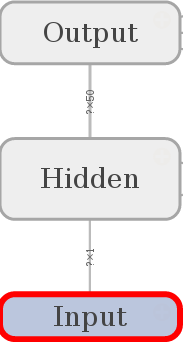
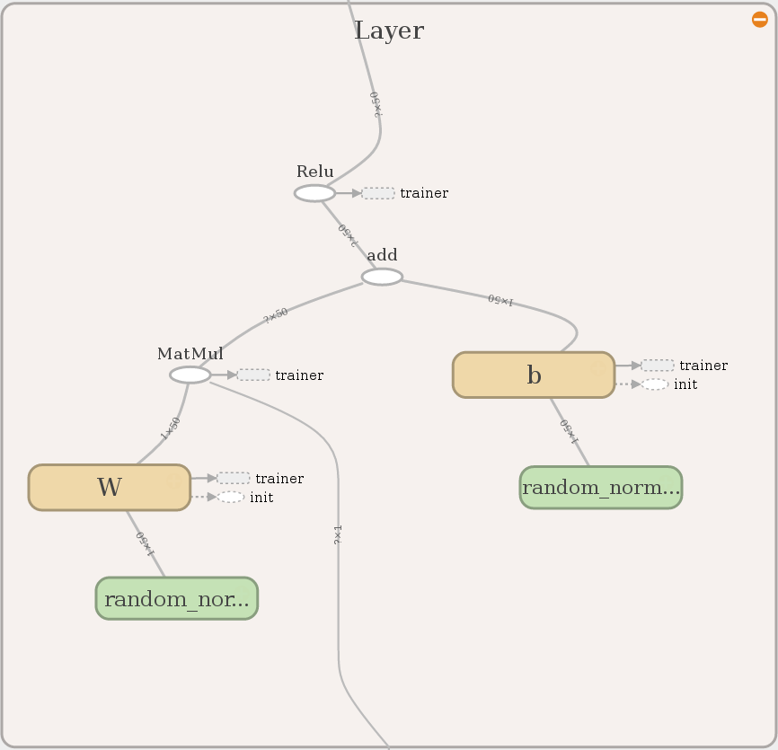
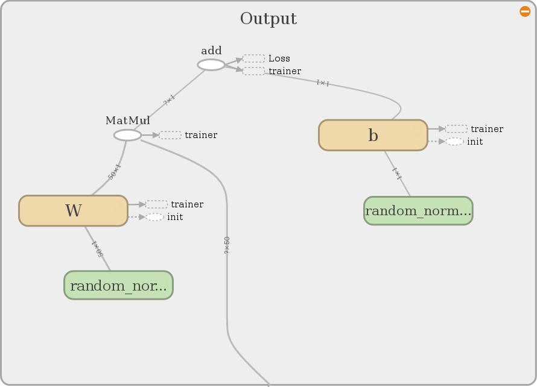
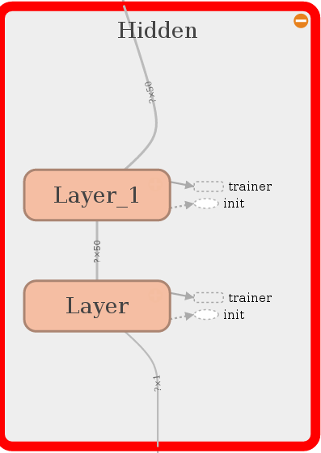
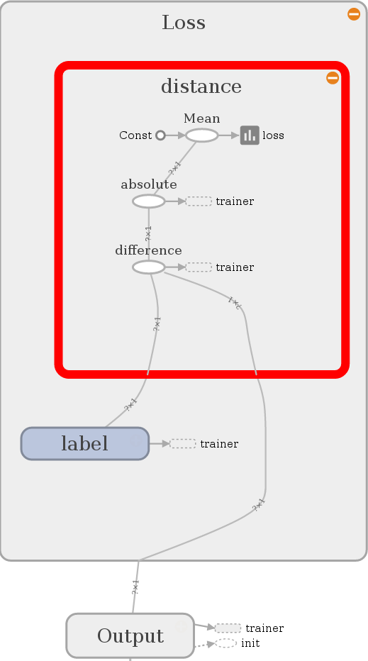
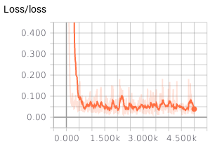
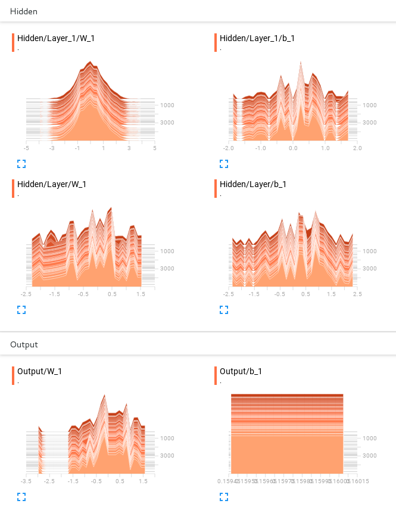
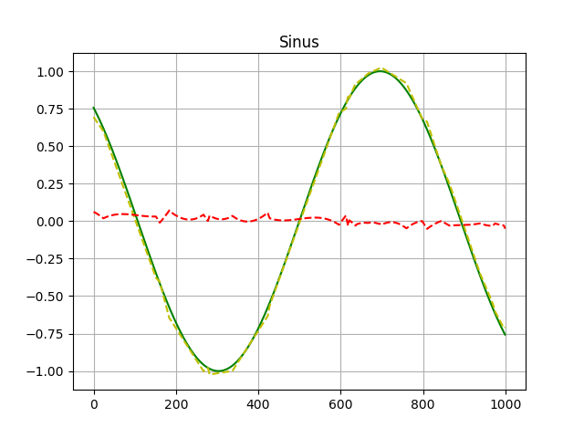

*more neurocat Workshops can be found in the official [blog](http://neurocats.github.io)*

## Introduction
I assume that the reader has a basic knowledge about neural networks. I 
will just explain how to build one with TensorFlow. I will not explain what a 
neural network is.

We will approximate **sinus** as a toy example. Luckily, we have every possible 
label provided because the function is well known.

Let's start right away.

## Code
First, we obviously have to import TensorFlow and NumPy. Additionally, we will
use matplotlib to see how well we approximated sinus by comparing the outcome
of the network to the original function visually.

```python
import tensorflow as tf
import numpy as np
import matplotlib.pyplot as plt
```

### Layer

We also need a placeholder for the input into the unit. Like in the last tutorial:
```python
# initialize placeholder for data input
with tf.name_scope("Input"):
    x = tf.placeholder(dtype=tf.float32, shape=[None, 1], name="x")
```
Notice that the first dimension of the placeholder assigns a `None`. This is
a practical trick to allow working with batches. This just means that we 
don't want to set a fixed number of how many data points we can feed inside this node. So we 
can input a vector of size $(N, 1)$ for $N \in  \mathbb{N}$ and get $N$ 
calculated values from the network. Assuming the cache of your device is 
sufficient.

If you want to take a look at what happens when you print x...
```
<tf.Tensor 'x:0' shape=(?, 1) dtype=float32>
```
... you can see that the internal representation of the `None` is a `?`.

To emphasize the computation graph representation of a calculation, I will now create the layers 
in a loop. The considered network is relatively small, so we could also create it by hand. 
However, it can be as 
huge as you want it to be.

```python
# think about the dimensions of your neural net (trial & error)
layer = [1, 50, 50, 1]

# hidden layer in a loop
with tf.name_scope("Hidden"):
    out = x
    for i in range(len(layer) - 2):
        with tf.name_scope("Layer"):
            # random initialization of weight and bis
            W = tf.Variable(
                tf.random_normal([layer[i], layer[i + 1]], dtype=tf.float32),
                name="W")
            b = tf.Variable(
                tf.random_normal([1, layer[i + 1]], dtype=tf.float32),
                name="b")

            # matrix operation
            out = tf.matmul(out, W) + b
            # activation function
            out = tf.nn.relu(out)

            # summarize histogram
            tf.summary.histogram("W", W)
            tf.summary.histogram("b", b)

# output layer
with tf.name_scope("Output"):
    # random initialization of weight and bis
    W = tf.Variable(
        tf.random_normal([layer[-2], layer[-1]], dtype=tf.float32),
        name="W")
    b = tf.Variable(
        tf.random_normal([1, layer[-1]], dtype=tf.float32),
        name="b")

    # matrix operation
    out = tf.matmul(out, W) + b

    # no activation for the output

    # summarize histogram
    tf.summary.histogram("W", W)
    tf.summary.histogram("b", b)
```
A look at the namescopes lets us assume that we build a graph like 
that:



The list `layer` represents the number of units in each layer of the network.
- 1 input,
- 2 x 50 hidden,
- and 1 output unit.

We create TensorFlow variables that need to be assigned with a initial 
value. `tf.matmul` obviously performs a matrix multiplication and `tf.nn.relu`
represents the **rectified linear unit** activation function.  
Note: We also could have taken sigmoid (`tf.nn.sigmoid`) or any other 
activation function that pops into your mind. 



Each layer contains a summary operation (for 
histograms) and the output layer has no activation function for convenience.
Everything else is the same for every layer.



The interested reader also may notice that the vertices of the graph contain
information about the dimension of the operations. Please ignore the nodes 
`loss` and `trainer` for now. We will elaborate on that later in this tutorial. 
First we have to make sure that TensorFlow understood what we wanted to do in the 
loop.



This looks just perfect. Let's proceed with creating a loss for the little 
network.

### Loss & Training
We have a beautiful computation right now, but in order to really 
approximate something we need a loss function that tells the network how 
it has done so far. We will make it easy for us and take the Euclidean distance
of label and output.

```python
# loss function
with tf.name_scope("Loss"):
    # supervised input labels
    with tf.name_scope("label"):
        y = tf.placeholder(dtype=tf.float32, shape=[None, 1], name="y")
    # euclidean distance as loss
    with tf.name_scope("distance"):
        loss = tf.subtract(out, y, name="difference")
        loss = tf.abs(loss, name="absolute")
        loss = tf.reduce_mean(loss)

    # summarise scalar
    tf.summary.scalar('loss', loss)
```
Note that the shape of `y` (labels) also contains a `None`. So we can 
process more than just one label when we need to. Figure out your 
hyperparameters on your own. There is no theory behind it. Just experience. 
Always remember that an AI engineer is like a slot machine addict!  
Let's see what we have build:



Looks nice, it compares the output with the label and calculates the 
Euclidean distance. It also calculates a mean for two reasons. First, we want
to have scalar values for the summary of the loss function. Second, remember
that the placeholders for `x` and `y` are very flexible and could evaluate 
multiple instances of the data set in one run.

The last operation is very easy for a user but a masterpiece of the 
developers of TensorFlow. Look how I can command the network to 
learn with respect to the lossfunction and the architecture:

```python
with tf.name_scope("trainer"):
    train_op = tf.train.AdamOptimizer().minimize(loss)
```

That is also the explanation why `loss` and `trainer` sneaked inside the 
graph representation of the previous samples. We just decide what the 
lossfunction is that we want to minimize with the Adam Optimizer. TensorFlow
automatically adapts the variables that influence the outcome via 
backpropagation. In the last lesson we learned that TensorFlow can automatically
calculate gradients. This is way more exciting.  
You can also decide which variables should be learnable and which not. But we won't 
go into detail about this since it would be too much for this tutorial.

### Computation
Before we start the TensorFlow session let us get over and done with the bureaucracy first.

```python
# for tensorboard usability just merge all summaries into one node
summary_op = tf.summary.merge_all()

# operation for initialize variables
init_op = tf.global_variables_initializer()

# determine training length and batch size
train_len = 5000
batch = 2000
```
Like in the last tutorials we merge all summaries. Additionally, this time 
we use a global variable initializer. If we don't do that we can't work with 
the model. Imagine it similar to a placeholder where we first have to feed 
values inside to get a reasonable output. Furthermore, we introduce 
`train_len` and `batch` which represent the epochs of training and the 
batchsize for the upcoming TensorFlow session:

```python
with tf.Session() as sess:
    # run operation for variable initialization
    sess.run(init_op)
    # create a writer
    writer = tf.summary.FileWriter("./graphs", sess.graph)
    for i in range(train_len):
        # randomly train with trainingset
        x_data = np.float32(np.random.uniform(-1, 1, (1, batch))).T
        y_data = np.float32(np.sin(4 * x_data))

        # run training operation
        sess.run(train_op, feed_dict={x: x_data, y: y_data})

        # summarize
        summary = sess.run(summary_op, feed_dict={x: x_data, y: y_data})
        writer.add_summary(summary, i)
```

Basically, we are executing the initialization operation `init_op`, creating a 
writer and loop over a uniformly random data set of labeled sinus values 
between -1 and 1. For that we are executing the training operation 
`train_op` by providing it with labeled data. In the end we are doing 
summaries that we can view here:



We also created histograms to measure the weights:



These can be very helpful for debugging your model. There is no theory 
behind it. However, if you see that all your weights are zero, maybe you made
a wrong initialization. If you notice that your bias or weights are jumping 
around without convergence, maybe you took not enough or too small layers. You 
have to develop a feeling for what they should look like. Start with easy 
models, play around a bit and slowly increase the size of your models.

### Inference
Now we want to see how the trained model is doing regarding its task. Here we 
basically have to feed the computation graph with x-values and compare the output to the
labels in an easy, understandable way. Note that the following is still done in 
the same session. Otherwise the variables wouldn't be saved. Advanced saving
and restoring will be the topic of our next tutorial.
```python
    # inference
    # check if everything worked out fine by visualizing equidistant testpoints
    samples = 1000
    x_data = np.float32(np.linspace(-1, 1, samples))[None, :].T
    y_data = np.float32(np.sin(4 * x_data))
    _out = sess.run(out, feed_dict={x: x_data})
writer.close()

# plot
fig = plt.figure(1)
ax1 = fig.add_subplot(111)
ax1.plot(y_data, 'g-')
ax1.plot(_out, 'y--')
ax1.plot(np.subtract(y_data, _out), 'r--')
ax1.set_title("Sinus")
ax1.grid(True)
plt.show()
```
As you can see we are just feeding our `x` with `x_data`, no labels needed
this time. The validation set contains 1000 equidistant labeled sinus values. 
Note: we never actually trained on that set before we randomly made our 
choice. The comparison with matplotlib looks like that:



I know not too impressive but a proof of concept. Green represents the 
original function, yellow shows how the network behaved in the validation 
set and red shows the difference between both.

- [Tensorflow 101](../)
- [Tensorboard](../board)
